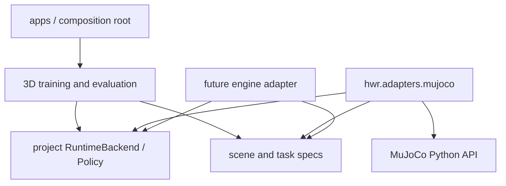

# ADR-0001：三维物理后端采用 MuJoCo 适配器

- 状态：接受
- 日期：2026-08-10
- 决策范围：家务具身智能三维拟真训练平台 V1

## 背景

现有 `Household2DEnv` 只能验证运行时、数据和训练闭环，不能作为三维家务仿真、接触操作或视觉策略的证据。V1 必须在当前 Apple Silicon 本机完成刚体物理、相机渲染、训练和闭环评测，同时保持项目自己的运行时协议，不把平台绑定到某个引擎。

本机基线为 Apple Silicon、51.5 GB 统一内存、Python 3.11。正式后端必须提供 macOS ARM64 原生包、关节系统、刚体接触、摩擦、相机、深度渲染和可离屏运行能力。

## 决策

V1 使用 **MuJoCo 3.10.x** 作为首个三维物理与传感器渲染后端，并固定在独立的 `hwr.adapters.mujoco` 包内。

选择理由：

- 官方 Python 包包含 MuJoCo 本体，并提供 Python 3.11 / macOS ARM64 wheel；
- 引擎直接支持多关节刚体动力学与接触；
- MJCF 能声明 mesh、texture、material、light、camera、joint、actuator 和 collision geom；
- Python 渲染器可从模型相机产生 RGB 和 depth；
- 同一模型可离屏训练，也可用官方查看器进行人工检查；
- Apache-2.0 许可允许把引擎作为项目依赖使用。

官方依据：

- [MuJoCo Python 绑定与安装](https://mujoco.readthedocs.io/en/latest/python.html)
- [MuJoCo 可视化与固定模型相机](https://mujoco.readthedocs.io/en/latest/programming/visualization.html)
- [MuJoCo 3.10.0 Python 包与 macOS ARM64 wheel](https://pypi.org/project/mujoco/3.10.0/)
- [MuJoCo 官方仓库与许可](https://github.com/google-deepmind/mujoco)

## 依赖边界

以下模块禁止导入 `mujoco`：

- `hwr.core`；
- `hwr.data`；
- `hwr.policy` 的公共协议和引擎无关模型；
- `hwr.train` 的公共训练循环；
- `hwr.scenarios` 的引擎无关任务声明。

只有 `hwr.adapters.mujoco`、面向该适配器的资产编译工具和最上层装配 CLI 可以导入 `mujoco`。仓库测试将扫描导入方向。

## 传感器边界

`ObservationFrame.cameras` 继续作为公共相机描述。V1 以向后兼容方式为 `CameraFrame` 增加可选的瞬时 `payload` 字节：

- `rgb8`：连续 H×W×3 字节；
- `depth32f`：连续 H×W float32 米制深度；
- 在线推理读取 payload；
- Episode 持久化时把图像写入媒体文件，只在 schema 中保存 URI、尺寸、编码和校验信息；
- 策略接口看不到 `MjModel`、`MjData` 或任何命名的仿真实体。

这使仿真和未来真机相机复用同一观察协议，而不是让策略直接访问引擎缓冲区。

## 接触与成功判定

- 物体仅允许在 `reset` 随机化阶段写入初始自由关节位姿；
- Episode 开始后，任务代码不得写物体 `qpos`、`xpos` 或姿态；
- 正式场景不得创建把物体焊接到夹爪的 equality/weld；
- 抓取由两侧夹指接触、夹持力和摩擦产生；
- 成功判定只读取物体物理位姿、容器空间关系与连续 2 秒稳定窗口；
- 抓取事件必须带左右夹指接触证据，视频录制不参与成功判定。

## 被否决方案

### 继续扩展二维后端

无法提供三维遮挡、相机图像、关节刚体动力学和可信接触，正式验收明确排除。

### 用 Blender 作为训练物理后端

适合高质量离线呈现，但不是本项目闭环机器人训练的首选物理 API。未来可通过 USD 导出用于展示，不作为成功判定来源。

### 直接采用某套机器人训练框架

会让 Observation、Action、Dataset 或 Policy 被外部框架定义，违背自有抽象要求。外部模型或资产只能通过适配器导入。

## 后果

- 正式训练增加 `sim3d` 可选依赖，二维测试仍可轻量运行；
- 三维资产需要来源、许可、尺度和哈希清单；
- macOS 离屏渲染必须通过自动 smoke test 验证；
- 将来替换引擎时保留公共 schema、任务、数据和策略层，只重写适配器。
