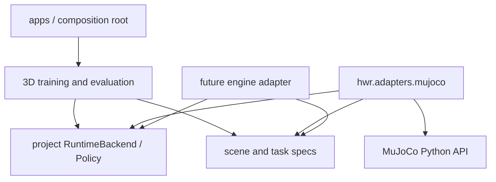

# ADR-0001: Use a MuJoCo Adapter for the 3D Physics Backend

- Status: Accepted
- Date: 2026-08-10
- Decision scope: V1 3D-realistic training platform for embodied housework intelligence

## Context

The existing `Household2DEnv` can validate only the runtime, data, and training loops; it cannot provide evidence for 3D housework simulation, contact manipulation, or visual policies. V1 must run rigid-body physics, camera rendering, training, and closed-loop evaluation on the current Apple Silicon machine while preserving the project's own runtime protocol and keeping the platform engine-independent.

The local baseline is Apple Silicon, 51.5 GB unified memory, and Python 3.11. The formal backend must provide a native macOS ARM64 package, joints, rigid-body contact, friction, cameras, depth rendering, and headless execution.

## Decision

V1 uses **MuJoCo 3.10.x** as its first 3D physics and sensor-rendering backend, fixed inside the dedicated `hwr.adapters.mujoco` package.

Reasons:

- The official Python package includes MuJoCo itself and provides a Python 3.11 / macOS ARM64 wheel;
- The engine directly supports multijoint rigid-body dynamics and contact;
- MJCF can declare mesh, texture, material, light, camera, joint, actuator, and collision geom;
- The Python renderer can produce RGB and depth from model cameras;
- The same model supports headless training and manual inspection in the official viewer;
- The Apache-2.0 license permits using the engine as a project dependency.

Official references:

- [MuJoCo Python bindings and installation](https://mujoco.readthedocs.io/en/latest/python.html)
- [MuJoCo visualization and fixed model cameras](https://mujoco.readthedocs.io/en/latest/programming/visualization.html)
- [MuJoCo 3.10.0 Python package and macOS ARM64 wheel](https://pypi.org/project/mujoco/3.10.0/)
- [MuJoCo official repository and license](https://github.com/google-deepmind/mujoco)

## Dependency Boundary

The following modules must not import `mujoco`:

- `hwr.core`;
- `hwr.data`;
- The public protocols and engine-independent models in `hwr.policy`;
- The public training loop in `hwr.train`;
- The engine-independent task declarations in `hwr.scenarios`.

Only `hwr.adapters.mujoco`, asset-compilation tools for that adapter, and the top-level composition CLI may import `mujoco`. Repository tests scan import directions.

## Sensor Boundary

`ObservationFrame.cameras` remains the public camera description. In a backward-compatible way, V1 adds optional instantaneous `payload` bytes to `CameraFrame`:

- `rgb8`: contiguous H×W×3 bytes;
- `depth32f`: contiguous H×W float32 depth in meters;
- Online inference reads the payload;
- When an Episode is persisted, images are written to media files, while the schema stores only the URI, dimensions, encoding, and checksum;
- The policy interface sees no `MjModel`, `MjData`, or named simulation entity.

This lets simulation and future real-robot cameras reuse the same observation protocol instead of letting the policy access engine buffers directly.

## Contact and Success Judgment

- Objects may have their initial free-joint poses written only during `reset` randomization;
- After an Episode begins, task code must not write object `qpos`, `xpos`, or pose;
- Formal scenes must not create an equality/weld that attaches an object to a gripper;
- Grasping is produced by contact between both sides of the gripper fingers, gripping force, and friction;
- Success judgment reads only object physical poses, container spatial relationships, and a continuous 2-second stability window;
- A grasp event must carry contact evidence from both left and right gripper fingers; video recording does not participate in success judgment.

## Rejected Alternatives

### Continue Extending the 2D Backend

It cannot provide 3D occlusion, camera images, multijoint rigid-body dynamics, or credible contact, and is explicitly excluded from formal acceptance.

### Use Blender as the Training Physics Backend

It is suitable for high-quality offline presentation but is not the preferred physics API for closed-loop robot training in this project. It may be exported through USD for presentation in the future, but is not a source of success judgments.

### Adopt a Robot-Training Framework Directly

This would let an external framework define Observation, Action, Dataset, or Policy, violating the in-house abstraction requirement. External models or assets may enter only through adapters.

## Consequences

- Formal training adds the optional `sim3d` dependency, while 2D tests remain lightweight;
- 3D assets require source, license, scale, and hash manifests;
- Headless rendering on macOS must be verified by an automated smoke test;
- If the engine is replaced in the future, retain the public schemas, task, data, and policy layers and rewrite only the adapter.
