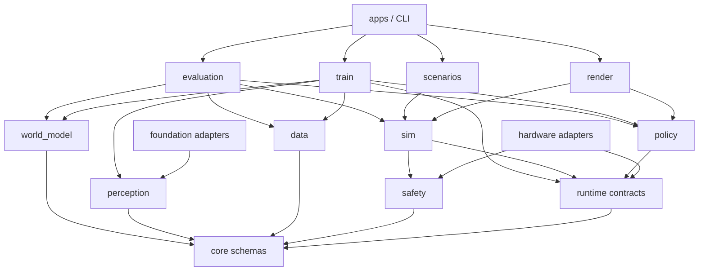
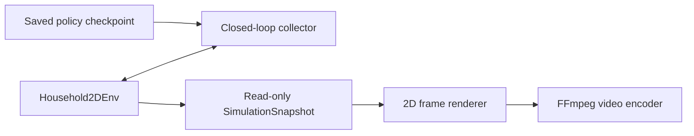

# Platform Architecture and Module Boundaries

> Version: V0.1
> Date: 2026-08-09

See the following for the frozen decisions and acceptance gates for the 3D-realism implementation:

- [Foundation-Model Perception, World Model, and Latent Reinforcement-Learning Paradigm](foundation-world-model-training-paradigm.md)
- [ADR-0001: Use a MuJoCo Adapter for the 3D Physics Backend](adr/0001-mujoco-3d-backend.md)
- [3D-Realistic Training Platform V1 Implementation and Acceptance Contract](three-dimensional-v1-acceptance.md)

## 1. Architecture Goals

The platform core is not tied to a robot model, simulation engine, training algorithm, compute device, or external data format. The real robot and realistic environment implement the same runtime protocol, while training, evaluation, and data tools depend only on the project's own schemas.

The architecture must support the following changes without modifying the core layer:

- Replace the arms, base, or cameras;
- Replace the realistic physics engine;
- Add a new policy network;
- Migrate from the local GPU to another training device;
- Add a new housework scene;
- Import or export a third-party data format.

## 2. Layers



Dependencies may point only downward:

1. `core` depends on no higher-level project module;
2. `runtime`, `data`, and `safety` depend only on `core`;
3. `sim` implements `runtime` and uses `safety`, but does not depend on training code;
4. `policy` depends only on core schemas and the tensor-computation interface;
5. `perception` and `world_model` depend only on core schemas and tensor interfaces; third-party foundation models implement their protocols only through adapters;
6. `train` depends on `data`, `perception`, `world_model`, `policy`, and the runtime protocol, sampling closed loops through an injected environment factory without importing a specific simulation backend;
7. `evaluation` is responsible for composing runtime, perception, world model, policy, and data;
8. `scenarios` contains only scene/task distributions, success criteria, and reward declarations, not policies, experts, or training loops;
9. `apps` and the CLI are the top-level composition entry points.

Cross-layer shortcuts are prohibited, such as a trainer reading an arm SDK directly or a simulation scene calling a specific policy class directly.

## 3. Directory Layout

```text
50-housework-robot/
├── AGENTS.md
├── docs/
│   ├── architecture.md
│   ├── low-cost-platform-proposal.md
│   └── training-and-simulation-plan.md
├── schemas/                    # Versioned schemas usable across languages
│   ├── robot/
│   ├── scene/
│   ├── task/
│   ├── episode/
│   └── policy/
├── src/hwr/
│   ├── core/                   # Data types, clocks, and runtime Protocol
│   ├── data/                   # Episodes, datasets, validation, and migration
│   ├── safety/                 # Action filtering, limits, and safety events
│   ├── sim/                    # SimBackend and reference realistic backend
│   ├── perception/             # High-resolution preprocessing, visual student, and multi-camera fusion
│   ├── world_model/            # Action-conditioned RSSM, prediction heads, and imagined rollout
│   ├── policy/                 # Policy protocol and model plugins
│   ├── train/                  # Representation, dynamics, imagined RL, and online training orchestration
│   ├── evaluation/             # Representation, world-model, closed-loop, and anti-cheating evaluation
│   ├── render/                 # Replay capture, 2D rendering, and video encoding
│   ├── scenarios/              # Housework scenes, task distributions, goals, and rewards
│   ├── adapters/               # Foundation-model, physics-engine, hardware, and data-format adapters
│   └── apps/                   # CLI and end-to-end assembly
├── configs/
│   ├── robots/
│   ├── scenes/
│   ├── tasks/
│   ├── randomization/
│   └── training/
├── assets/                     # Small, version-controlled source assets
│   ├── manifests/              # Provenance, licenses, and upstream/processed hash locks
│   ├── household_v1/           # Metric, Z-up formal scene meshes with UVs
│   └── mujoco/                 # MJCF scenes and robot assemblies
├── scripts/                    # Repository checks and development scripts
├── tests/
│   ├── unit/
│   ├── integration/
│   └── smoke/
├── datasets/                   # Git-ignored, generated at runtime
├── models/                     # Git-ignored, generated at runtime
└── runs/                       # Git-ignored, generated at runtime
```

Create directories incrementally as needed; do not prepopulate empty packages.

## 4. Core Module Responsibilities

### `hwr.core`

- Versioned Observation, Action, Event, and Episode types;
- Monotonic and deterministic simulation clocks;
- Protocols such as `RuntimeBackend` and `Policy`;
- No I/O, concrete environments, neural networks, or device code.

### `hwr.data`

- Atomic Episode writing, validation, and deterministic replay;
- Dataset indexing, splitting, statistics, and version migration;
- Data-format converters integrated through `adapters`.

### `hwr.safety`

- Action validity periods, velocity, joint, and gripper limits;
- Stop actions and safety events;
- No model-internal state reads and no trainer dependency.

### `hwr.sim`

- Reference implementation of `SimBackend`;
- Parameterized robots, objects, sensors, and dynamics;
- Fixed-seed replay, randomization, and system-identification parameters;
- Does not store training data or implement model optimization.

`Household2DEnv` is retained only as a runtime smoke test and does not count toward 3D realism, housework-task training, or video acceptance. The formal V1 backend is in `hwr.adapters.mujoco`; engine dependencies must not leak into `core`, `data`, `policy`, `train`, or engine-independent `scenarios`.

Formal 3D assets also have a one-way boundary: `assets/manifests` stores engine-independent source, license, scale, and hashes, while `scripts/fetch_3d_assets.py` handles only reproducible downloading and coordinate normalization; MuJoCo mesh/material declarations belong in `assets/mujoco`. Scenes must not fetch unlocked models from the network at runtime or paste rendering thumbnails onto base collision bodies as fake 3D furniture. Visible meshes and simplified collision bodies must be declared separately.

Formal tasks are also split into two configurations; engine object names must not leak into the policy or task layers:

- `configs/tasks/formal_3d_v1.json`: Project-owned task/scene/object/target IDs, instructions, reset ranges, randomization, and success thresholds;
- `configs/adapters/mujoco/formal_3d_v1.json`: Binds these IDs to MJCF body/joint/geom/site only on the adapter side.

`MujocoFormalHouseholdDualArmBackend` still exposes only the project's own dual-arm `RuntimeBackend`, sharing the 16-dimensional action space and `DualArmObservation` with future real hardware. Ground-truth entity poses, target sites, contact forces, and drawer joints are used only for reset, rewards, automatic success judgment, and read-only audits; they do not produce action labels or enter Actor observations. Online observations are fixed to head RGB-D, left/right wrist RGB, dynamic calibration, dual-arm proprioception, and natural-language instructions.

The scene's safe initial arm pose belongs to the MuJoCo binding, not the core task schema or Actor plan. The adapter must validate the six-dimensional joint initial values on load; reset regression tests require that, without actions, objects are supported by real furniture, the robot and task objects have no initial interpenetration, object velocities converge, and no severe collision occurs. This pose defines only the Episode's physical starting point; it contains no future actions, grasp-pose sequence, or task stage.

Expert-free training uses the optional `SnapshotRuntimeBackend` extension to change the initial-state distribution. The core-layer `PhysicalStateSnapshot` defines only a task ID, adapter fingerprint, and opaque instantaneous dynamics vector, including generalized position/velocity/acceleration, current actuator loads, and solver state; it does not interpret engine layout or carry rewards, stages, or future action sequences. MuJoCo may restore a snapshot only at the Episode `reset` boundary; dimension validation, controller synchronization, derived-value recomputation, and contact reconstruction all remain inside the adapter, and writes during a run are still rejected by anti-teleport checks. `hwr.adapters.mujoco.training_catalog` composes the task, MuJoCo binding, and backend factory; `hwr.train` receives only the project-owned protocol instance returned by the factory and does not import MuJoCo or a specific device SDK.

### `hwr.policy`

- Observation encoding, action decoding, and `Policy` plugins;
- Model serialization and inference;
- Does not handle dataset splitting or closed-loop evaluation.

### `hwr.perception`

- Defines the frozen foundation-model continuous-feature protocol, high-resolution visual preprocessing, the visual student, and multi-camera temporal fusion;
- Does not depend on Transformers, model-download services, or a specific weight format;
- Does not output object/target tokens, skills, plans, or actions;
- Third-party model implementations may exist only in `hwr.adapters.foundation`.

### `hwr.world_model`

- Implements the action-conditioned recurrent state-space model, outcome-prediction heads, and imagined rollouts;
- Depends only on project core schemas and tensor interfaces, and does not import MuJoCo, hardware SDKs, or scene classes;
- Learns physical causality from actions actually executed by the safety layer; it does not generate expert actions or search over deployment-time actions;
- Provides action-shuffling counterfactual and multistep open-loop evaluation interfaces.

### `hwr.train`

- Expert-free online environment sampling, experience replay, Actor-Critic optimization, automatic curricula, checkpoints, and experiment manifests;
- Receives environment instances only through the core runtime protocol and must not import MuJoCo or hardware adapters;
- `frontier_curriculum` manages only autonomously discovered initial-state candidates and source audits; it does not interpret adapter snapshots or output actions;
- Frontier reset performs only action-free backend-fingerprint, generalized-position, and velocity consistency checks; it must not close grippers, move arms, or run other probes outside an Episode;
- The Critic may receive privileged observations during training but must not output actions, demonstrations, or features visible to the Actor;
- Compute-device selection is encapsulated in the training backend;
- Does not read expert data, teleoperation actions, or teacher checkpoints.

### `hwr.evaluation`

- Offline error, closed-loop success rate, and robustness evaluation;
- Model admission gates and evaluation reports;
- Operates environments through the runtime protocol.

### `hwr.render`

- Calls a saved `Policy` for closed-loop inference and captures read-only simulation snapshots;
- Rasterizes snapshots into frames and outputs standard video through an external encoder;
- Handles observation and presentation only; it does not modify environment dynamics, policy actions, or task judgments;
- The current 2D renderer depends on the reference `Household2DEnv`; future 3D engines provide their own rendering adapters.

The replay pipeline is organized along the following boundary:



`SimulationSnapshot` is an immutable copy of simulation state. The renderer must not directly hold or modify `SimRobotState` or `SimObjectState`; enabling video recording therefore does not change the control-loop result, and tests can verify that “the trajectory is identical before and after recording.”

### `hwr.scenarios`

- SceneSpec, TaskSpec, initial-state distributions, natural-language expressions, reward/termination interfaces, valid environment transformations, and randomization ranges;
- Read-only-state success/failure criteria, reward terms, and safety outcomes;
- Independent declarations for each scene, without duplicating runtime or training code;
- No waypoints, grasp poses, left/right arm assignments, action scripts, or imitable expert policies.

## 5. Stable Interfaces

After entering V1, the following interfaces may evolve only backward-compatibly:

- `ObservationFrame`；
- `ActionFrame`；
- `EpisodeEvent`；
- `EpisodeMetadata`；
- `RuntimeBackend`；
- `Policy` and `PolicySpec`;
- Persistent schemas for Robot, Scene, and Task.

Any breaking change must:

1. Bump the schema version;
2. Provide a migrator;
3. Retain tests for reading old data;
4. Explain the reason in an architecture decision record.

## 6. Code-Size Constraints

- Python files may contain at most 800 physical lines;
- Python functions, async functions, or methods may contain at most 200 physical lines;
- Once a file reaches 600 lines or a function reaches 120 lines, splitting should be evaluated first;
- Split by responsibility; do not evade the limits through minification, semicolons, or reduced readability;
- `scripts/check_python_size.py` checks `src`, `tests`, and `scripts` automatically;
- Size checks and tests must pass before every phase commit.

## 7. Current Implementation Order

Current implementation is governed by one unified development gate. Foundation-model adapters, high-resolution perception, the visual student, sequence data, the action-conditioned world model, imagined RL, deployment export, anti-cheating, and closed-loop evaluation may be developed and committed independently in dependency order, but training must not start while any module is incomplete. Only after all implementations and tests pass and `development-ready.json` is generated may unified formal training covering all three tasks begin. See [Current Training Paradigm](foundation-world-model-training-paradigm.md#9-definition-of-development-completion) for the detailed completion definition.
