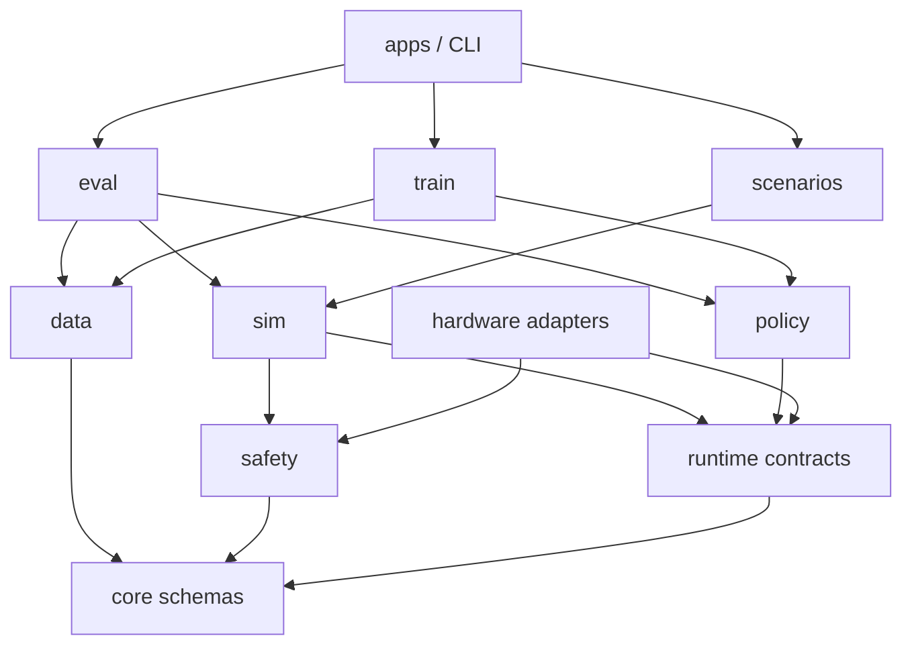

# 平台架构与模块边界

> 版本：V0.1  
> 日期：2026-08-09

## 1. 架构目标

平台核心不绑定机器人型号、仿真引擎、训练算法、计算设备或外部数据格式。真实机器人与拟真环境共同实现同一运行时协议，训练、评测和数据工具只依赖项目自己的 schema。

架构需要支持以下变化而不改动核心层：

- 替换机械臂、底盘或相机；
- 替换拟真物理引擎；
- 增加新的策略网络；
- 从本机 GPU 迁移到其他训练设备；
- 增加新的家务场景；
- 导入或导出第三方数据格式。

## 2. 分层



依赖只能由上向下：

1. `core` 不依赖任何项目上层模块；
2. `runtime`、`data`、`safety` 只依赖 `core`；
3. `sim` 实现 `runtime`，并使用 `safety`，但不依赖训练代码；
4. `policy` 只依赖核心 schema 和张量计算接口；
5. `train` 依赖 `data` 与 `policy`，不直接访问仿真后端；
6. `eval` 负责组合 `sim`、`policy` 和 `data`；
7. `scenarios` 只包含场景/任务声明和专家策略，不包含训练循环；
8. `apps` 和 CLI 是最上层装配入口。

禁止跨层捷径，例如训练器直接读取某个机械臂 SDK，或仿真场景直接调用某个策略类。

## 3. 目录规划

```text
50-housework-robot/
├── AGENTS.md
├── docs/
│   ├── architecture.md
│   ├── low-cost-platform-proposal.md
│   └── training-and-simulation-plan.md
├── schemas/                    # 可跨语言使用的版本化 schema
│   ├── robot/
│   ├── scene/
│   ├── task/
│   ├── episode/
│   └── policy/
├── src/hwr/
│   ├── core/                   # 数据类型、时钟、运行时 Protocol
│   ├── data/                   # Episode、Dataset、校验与迁移
│   ├── safety/                 # 动作过滤、限位和安全事件
│   ├── sim/                    # SimBackend 与参考拟真后端
│   ├── policy/                 # Policy 协议和模型插件
│   ├── train/                  # 训练循环和实验产物
│   ├── eval/                   # 离线与闭环评测
│   ├── scenarios/              # 家务场景、任务和专家
│   ├── adapters/               # 物理引擎、硬件、数据格式适配器
│   └── apps/                   # CLI 和端到端装配
├── configs/
│   ├── robots/
│   ├── scenes/
│   ├── tasks/
│   ├── randomization/
│   └── training/
├── assets/                     # 小型、可版本管理的源资产
├── scripts/                    # 仓库检查和开发脚本
├── tests/
│   ├── unit/
│   ├── integration/
│   └── smoke/
├── datasets/                   # Git 忽略，运行时生成
├── models/                     # Git 忽略，运行时生成
└── runs/                       # Git 忽略，运行时生成
```

目录按需要逐步创建，不提前放置空包。

## 4. 核心模块职责

### `hwr.core`

- 版本化 Observation、Action、Event、Episode 类型；
- 单调时钟和确定性仿真时钟；
- `RuntimeBackend`、`Policy` 等协议；
- 不包含 I/O、具体环境、神经网络或设备代码。

### `hwr.data`

- Episode 原子写入、校验和确定性回放；
- Dataset 索引、切分、统计和版本迁移；
- 数据格式转换器通过 `adapters` 接入。

### `hwr.safety`

- 动作有效期、速度、关节和夹爪限幅；
- 停止动作和安全事件；
- 不读取模型内部状态，不依赖训练器。

### `hwr.sim`

- `SimBackend` 的参考实现；
- 参数化机器人、物体、传感器和动力学；
- 固定种子重放、随机化和系统辨识参数；
- 不保存训练数据，不实现模型优化。

### `hwr.policy`

- 观测编码、动作解码和 `Policy` 插件；
- 模型序列化和推理；
- 不负责数据集切分和闭环评测。

### `hwr.train`

- 数据加载、优化循环、检查点和实验 manifest；
- 计算设备选择封装在训练后端；
- 不直接调用硬件或仿真引擎。

### `hwr.eval`

- 离线误差、闭环成功率和鲁棒性评测；
- 模型准入门槛与评测报告；
- 通过运行时协议操作环境。

### `hwr.scenarios`

- SceneSpec、TaskSpec、随机化范围和规则专家；
- 每个场景独立声明，不复制运行时和训练代码；
- 场景间共享技能时抽取为公共组件。

## 5. 稳定接口

以下接口进入 V1 后只能向后兼容演进：

- `ObservationFrame`；
- `ActionFrame`；
- `EpisodeEvent`；
- `EpisodeMetadata`；
- `RuntimeBackend`；
- `Policy` 与 `PolicySpec`；
- Robot、Scene、Task 的持久化 schema。

任何破坏性变化必须：

1. 提升 schema 版本；
2. 提供迁移器；
3. 保留旧数据读取测试；
4. 在架构决策记录中说明原因。

## 6. 代码尺寸约束

- Python 文件最多 800 个物理行；
- Python 函数、异步函数或方法最多 200 个物理行；
- 达到文件 600 行或函数 120 行时，应优先评估拆分；
- 按职责拆分，禁止通过压缩格式、分号或删除可读性来规避限制；
- `scripts/check_python_size.py` 对 `src`、`tests` 和 `scripts` 自动检查；
- 尺寸检查与测试必须在每次阶段提交前通过。

## 7. 当前实施顺序

1. 核心 schema、时钟、运行时协议；
2. Episode 录制、校验和回放；
3. 安全动作过滤；
4. 确定性二维拟真后端；
5. 场景和规则专家；
6. Dataset 和策略训练；
7. 闭环评测；
8. 三个家务场景训练；
9. 真实硬件适配器。

