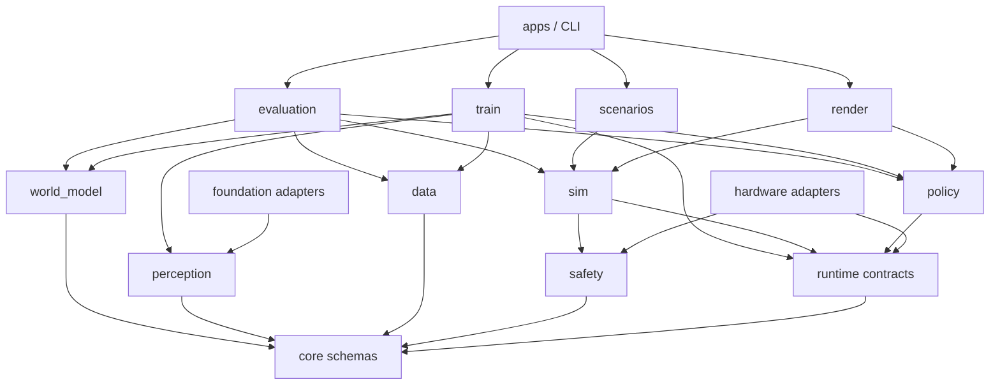
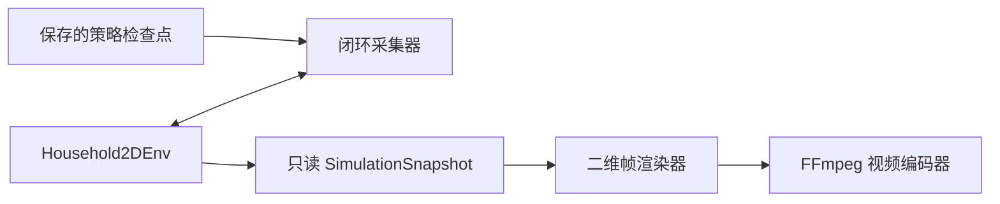

# 平台架构与模块边界

> 版本：V0.1  
> 日期：2026-08-09

三维拟真实施的冻结决策与验收门槛见：

- [基础模型感知、世界模型与想象强化学习范式](foundation-world-model-training-paradigm.md)
- [ADR-0001：三维物理后端采用 MuJoCo 适配器](adr/0001-mujoco-3d-backend.md)
- [三维拟真训练平台 V1 实施与验收合同](three-dimensional-v1-acceptance.md)

## 1. 架构目标

平台核心不绑定机器人型号、仿真引擎、训练算法、计算设备或外部数据格式。真实机器人与拟真环境共同实现同一运行时协议，训练、评测和数据工具只依赖项目自己的 schema。

架构需要支持以下变化而不改动核心层：

- 替换机械臂、底盘或相机；
- 替换拟真物理引擎；
- 增加新的策略网络；
- 从本机 GPU 迁移到其他训练设备；
- 增加新的家务场景；
- 导入或导出第三方数据格式。

## 2. 分层



依赖只能由上向下：

1. `core` 不依赖任何项目上层模块；
2. `runtime`、`data`、`safety` 只依赖 `core`；
3. `sim` 实现 `runtime`，并使用 `safety`，但不依赖训练代码；
4. `policy` 只依赖核心 schema 和张量计算接口；
5. `perception` 和 `world_model` 只依赖核心 schema 与张量接口，第三方基础模型只能从适配器实现其协议；
6. `train` 依赖 `data`、`perception`、`world_model`、`policy` 和运行时协议，通过注入的环境工厂闭环采样，不导入具体仿真后端；
7. `evaluation` 负责组合运行时、感知、世界模型、策略和数据；
8. `scenarios` 只包含场景/任务分布、成功判据和奖励声明，不包含策略、专家或训练循环；
9. `apps` 和 CLI 是最上层装配入口。

禁止跨层捷径，例如训练器直接读取某个机械臂 SDK，或仿真场景直接调用某个策略类。

## 3. 目录规划

```text
50-housework-robot/
├── AGENTS.md
├── docs/
│   ├── architecture.md
│   ├── low-cost-platform-proposal.md
│   └── training-and-simulation-plan.md
├── schemas/                    # 可跨语言使用的版本化 schema
│   ├── robot/
│   ├── scene/
│   ├── task/
│   ├── episode/
│   └── policy/
├── src/hwr/
│   ├── core/                   # 数据类型、时钟、运行时 Protocol
│   ├── data/                   # Episode、Dataset、校验与迁移
│   ├── safety/                 # 动作过滤、限位和安全事件
│   ├── sim/                    # SimBackend 与参考拟真后端
│   ├── perception/             # 高分辨率预处理、视觉学生和多相机融合
│   ├── world_model/            # 动作条件 RSSM、预测头和想象 rollout
│   ├── policy/                 # Policy 协议和模型插件
│   ├── train/                  # 表征、动力学、想象 RL 和在线训练编排
│   ├── evaluation/             # 表征、世界模型、闭环与反作弊评测
│   ├── render/                 # 回放采集、二维渲染和视频编码
│   ├── scenarios/              # 家务场景、任务分布、目标与奖励
│   ├── adapters/               # 基础模型、物理引擎、硬件和数据格式适配器
│   └── apps/                   # CLI 和端到端装配
├── configs/
│   ├── robots/
│   ├── scenes/
│   ├── tasks/
│   ├── randomization/
│   └── training/
├── assets/                     # 小型、可版本管理的源资产
│   ├── manifests/              # 来源、许可、上游/处理后哈希锁
│   ├── household_v1/           # 米制、Z-up、带 UV 的正式场景网格
│   └── mujoco/                 # MJCF 场景与机器人装配
├── scripts/                    # 仓库检查和开发脚本
├── tests/
│   ├── unit/
│   ├── integration/
│   └── smoke/
├── datasets/                   # Git 忽略，运行时生成
├── models/                     # Git 忽略，运行时生成
└── runs/                       # Git 忽略，运行时生成
```

目录按需要逐步创建，不提前放置空包。

## 4. 核心模块职责

### `hwr.core`

- 版本化 Observation、Action、Event、Episode 类型；
- 单调时钟和确定性仿真时钟；
- `RuntimeBackend`、`Policy` 等协议；
- 不包含 I/O、具体环境、神经网络或设备代码。

### `hwr.data`

- Episode 原子写入、校验和确定性回放；
- Dataset 索引、切分、统计和版本迁移；
- 数据格式转换器通过 `adapters` 接入。

### `hwr.safety`

- 动作有效期、速度、关节和夹爪限幅；
- 停止动作和安全事件；
- 不读取模型内部状态，不依赖训练器。

### `hwr.sim`

- `SimBackend` 的参考实现；
- 参数化机器人、物体、传感器和动力学；
- 固定种子重放、随机化和系统辨识参数；
- 不保存训练数据，不实现模型优化。

当前 `Household2DEnv` 仅保留为运行时 smoke test，不计入三维拟真、家务任务训练或视频验收。
正式 V1 后端位于 `hwr.adapters.mujoco`，引擎依赖不得泄漏到 `core`、`data`、`policy`、
`train` 或引擎无关的 `scenarios`。

正式三维资产也有单向边界：`assets/manifests` 保存与引擎无关的来源、许可、尺度和哈希，
`scripts/fetch_3d_assets.py` 只负责可重复的下载与坐标归一化；MuJoCo 的 mesh/material 声明
位于 `assets/mujoco`。场景不得从网络临时拉取未锁定模型，也不得把渲染缩略图贴到基础碰撞体上
冒充三维家具。可见网格与简化碰撞体必须分别声明。

正式任务也拆成两份配置，禁止把引擎对象名泄漏到策略或任务层：

- `configs/tasks/formal_3d_v1.json`：项目自有的 task/scene/object/target ID、指令、重置范围、随机化和成功门槛；
- `configs/adapters/mujoco/formal_3d_v1.json`：只在适配器侧把这些 ID 绑定到 MJCF body/joint/geom/site。

`MujocoHouseholdBackend` 对上仍只实现 `RuntimeBackend`。真值实体位姿、目标 site、接触力和抽屉关节只用于 reset、自动成功判定、训练期 Critic 与只读审计，不产生动作标签，也不进入 `ObservationFrame.features`；在线观察固定为头部和左右腕部相机 payload 与双臂本体状态。

场景的安全初始机械臂姿态属于 MuJoCo binding，而不是核心任务 schema 或 Actor 计划。适配器加载时必须验证六维关节初值；重置回归测试要求无动作情况下物体由真实家具支撑、机器人与任务物体没有初始穿模、物体速度收敛且不产生严重碰撞。该姿态只定义 Episode 的物理起点，不包含未来动作、抓取姿态序列或任务阶段。

无专家训练使用可选的 `SnapshotRuntimeBackend` 扩展改变初始状态分布。核心层的 `PhysicalStateSnapshot` 只定义任务 ID、适配器指纹和不透明的瞬时动力学向量，包括广义位置/速度/加速度、当前执行器载荷与求解器状态；它不解释引擎布局，也不携带奖励、阶段或未来动作序列。MuJoCo 只能在 Episode `reset` 边界恢复快照，维度校验、控制器同步、派生量重算和接触重建全部留在适配器内部，运行中写入仍由反瞬移检查拒绝。`hwr.adapters.mujoco.training_catalog` 负责把任务、MuJoCo binding 和 backend factory 组合起来，`hwr.train` 只接收 factory 返回的项目自有协议实例，不导入 MuJoCo 或具体设备 SDK。

### `hwr.policy`

- 观测编码、动作解码和 `Policy` 插件；
- 模型序列化和推理；
- 不负责数据集切分和闭环评测。

### `hwr.perception`

- 定义冻结基础模型连续特征协议、高分辨率视觉预处理、视觉学生和多相机时序融合；
- 不依赖 Transformers、模型下载服务或具体权重格式；
- 不输出对象/目标 token、技能、计划或动作；
- 第三方模型实现只能位于 `hwr.adapters.foundation`。

### `hwr.world_model`

- 实现动作条件 recurrent state-space model、结果预测头和想象 rollout；
- 只依赖项目核心 schema 与张量接口，不导入 MuJoCo、硬件 SDK 或场景类；
- 以安全层实际执行动作学习物理因果，不生成专家动作或部署时动作搜索；
- 提供动作打乱反事实和多步 open-loop 评测接口。

### `hwr.train`

- 无专家的在线环境采样、经验回放、Actor-Critic 优化、自动课程、检查点和实验 manifest；
- 只通过核心运行时协议接收环境实例，禁止导入 MuJoCo 或硬件适配器；
- `frontier_curriculum` 只管理自主发现的初始状态候选与来源审计，不解释适配器快照、不输出动作；
- frontier reset 只做无动作的后端指纹、广义位置和速度一致性校验；不得运行闭夹爪、移动机械臂或其他 Episode 外探针动作；
- Critic 可以接收训练期特权观察，但不得输出动作、示范或 Actor 可见特征；
- 计算设备选择封装在训练后端；
- 不读取专家数据、遥操作动作或教师 checkpoint。

### `hwr.evaluation`

- 离线误差、闭环成功率和鲁棒性评测；
- 模型准入门槛与评测报告；
- 通过运行时协议操作环境。

### `hwr.render`

- 调用已保存的 `Policy` 做闭环推理，采集只读仿真快照；
- 将快照光栅化为帧，并通过外部编码器输出标准视频；
- 只负责观察和呈现，不修改环境动力学、策略动作或任务判定；
- 当前二维渲染器依赖参考 `Household2DEnv`，未来三维引擎提供各自的渲染适配器。

回放链路按以下边界组织：



`SimulationSnapshot` 是仿真状态的不可变副本。渲染器不得直接持有或修改
`SimRobotState`、`SimObjectState`；这样开启视频录制不会改变控制循环结果，也能用测试验证
“录制前后轨迹一致”。

### `hwr.scenarios`

- SceneSpec、TaskSpec、初始状态分布、自然语言表达、奖励/终止接口、合法环境变换和随机化范围；
- 只读状态的成功/失败判据、奖励项和安全结果；
- 每个场景独立声明，不复制运行时和训练代码；
- 不包含航点、抓取姿态、左右臂分工、动作脚本或任何可被模仿的专家策略。

## 5. 稳定接口

以下接口进入 V1 后只能向后兼容演进：

- `ObservationFrame`；
- `ActionFrame`；
- `EpisodeEvent`；
- `EpisodeMetadata`；
- `RuntimeBackend`；
- `Policy` 与 `PolicySpec`；
- Robot、Scene、Task 的持久化 schema。

任何破坏性变化必须：

1. 提升 schema 版本；
2. 提供迁移器；
3. 保留旧数据读取测试；
4. 在架构决策记录中说明原因。

## 6. 代码尺寸约束

- Python 文件最多 800 个物理行；
- Python 函数、异步函数或方法最多 200 个物理行；
- 达到文件 600 行或函数 120 行时，应优先评估拆分；
- 按职责拆分，禁止通过压缩格式、分号或删除可读性来规避限制；
- `scripts/check_python_size.py` 对 `src`、`tests` 和 `scripts` 自动检查；
- 尺寸检查与测试必须在每次阶段提交前通过。

## 7. 当前实施顺序

当前实施受一个统一开发门禁约束。基础模型适配、高分辨率感知、视觉学生、序列数据、
动作条件世界模型、想象 RL、部署导出、反作弊和闭环评测可以按依赖顺序开发并独立提交，
但不得在任一模块尚未完成时启动训练。全部实现和测试通过并生成
`development-ready.json` 后，才进入同时覆盖三个任务的统一正式训练。详细完成定义见
[当前训练范式](foundation-world-model-training-paradigm.md#9-开发完成定义)。
