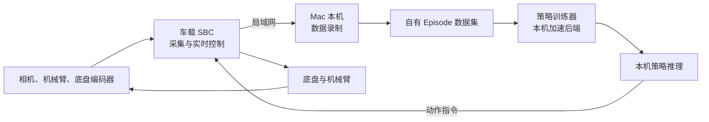

# 万元内家务具身智能训练平台方案

> 版本：V0.2  
> 日期：2026-08-09  
> 预算上限：人民币 10,000 元（不含现有 Mac）

配套文档：[训练与拟真环境方案](./training-and-simulation-plan.md)；训练架构以[端到端视觉—语言—动作训练范式](./end-to-end-training-paradigm.md)为准。本文中关于固定路线、任务编排和学习范围的早期描述只作为预算与硬件降级参考，不再约束当前仿真训练。

## 1. 方案结论

在 1 万元预算内，平台定位为“低成本移动操作研究平台”，而不是可直接投入家庭使用的通用家务机器人。

首版保留以下完整闭环：

1. 四轮移动底盘；
2. 双 RGB 相机；
3. 一套具有关节反馈和夹爪的低成本机械臂；
4. 遥操作采集；
5. 自有数据规范和本机策略训练；
6. 本机推理、真机评测、失败数据回流和再训练。

为满足预算，需要暂时取消电动升降柱、激光雷达、深度相机、六维力传感器和 Jetson 等机载 GPU。底盘导航采用轮编码器、IMU、AprilTag 和固定工作区路线；学习策略优先负责机械臂的近距离操作。

现有训练机为 Apple M5 Pro、48 GB 统一内存，可以承担首版视觉行为克隆模型的本机训练和推理。方案编写时系统根卷可用空间约 77 GiB，因此将 1 TB 外置 SSD 列为必选项。

平台的设备接口、数据格式、策略接口、任务编排和安全协议均由本项目定义。任何机械臂、底盘、训练算法或第三方工具都只能通过适配器接入，不能成为核心架构的一部分。

## 2. 第一阶段任务

首个端到端任务定义为：

> 小车从起点移动到带 AprilTag 的工作台，完成视觉对准，抓取桌上的海绵、纸杯或玩具，放入指定收纳篮，最后返回起点。

选择该任务的原因是它可以同时验证：

- 底盘运动和里程计；
- 视觉定位与工作位对准；
- 机械臂遥操作和示范采集；
- 图像、机器人状态和动作的时间同步；
- 模仿学习训练和真机推理；
- 失败检测、人工接管和数据回流。

首版目标物重量建议小于 200 g，工作台和收纳篮应位于固定高度范围内。

## 3. 系统架构



### 3.1 车载侧

车载 SBC 运行 Ubuntu，负责：

- 采集环境相机和腕部相机；
- 读取机械臂关节、夹爪、轮编码器和 IMU；
- 对视频进行硬件或软件编码；
- 执行底盘速度闭环；
- 接收 Mac 下发的机械臂动作块和底盘速度；
- 执行通信看门狗、动作限幅和紧急停车。

底盘的电机速度环、急停和通信超时停车放在 ESP32-S3 或 STM32 上实现，不能依赖 Mac、Wi-Fi 或学习模型。

### 3.2 Mac 侧

Mac 负责：

- 遥操作设备调度；
- 多模态数据录制和数据质量检查；
- 自有 Episode 数据集生成；
- 策略训练、评测和模型版本管理；
- 10～15 Hz 策略推理；
- 评测结果、失败轨迹和人工接管数据回流。

Mac 与机器人之间使用专用局域网通信，不依赖互联网或云端服务。Mac 休眠、网络中断或推理进程退出时，车载控制器必须在超时后自动停车并卸载高风险动作。

### 3.3 自有核心抽象

核心代码不直接依赖具体设备型号，按以下接口组织：

- `ArmDevice`：能力描述、读取关节状态、位置/速度指令、夹爪指令、停止；
- `MobileBaseDevice`：读取轮速和里程计、底盘速度指令、制动；
- `CameraDevice`：相机内外参、图像帧、采集时间戳；
- `TeleopDevice`：输出统一遥操作意图，不关心输入来自手柄、主臂还是其他设备；
- `SafetyDevice`：急停、看门狗、限位、过流和故障状态；
- `RobotRuntime`：设备生命周期、时钟同步、观测聚合、动作下发；
- `EpisodeRecorder`：按自有规范保存原始观测、动作、事件和元数据；
- `Policy`：接收观测窗口，输出带时间范围的动作块；
- `Skill`：定义前置条件、执行、取消、结果和恢复动作。

统一约定使用 SI 单位、弧度、右手坐标系和单调纳秒时间戳。机器人本体坐标、机械臂基座、末端和相机坐标均进入版本化坐标树，标定结果不写死在驱动中。

核心数据对象包括：

- `ObservationFrame`：图像、关节、夹爪、底盘、IMU 和安全状态；
- `ActionFrame`：目标动作、实际下发动作、有效时间和来源；
- `Episode`：任务、帧序列、事件、结果、标定版本和模型版本；
- `PolicySpec`：模型所需观测、动作空间、历史窗口和推理频率；
- `RobotCapabilities`：当前硬件可提供的传感器、执行器和控制模式。

设备驱动、算法实现和数据格式转换器均位于外围适配层。替换机械臂或训练算法时，不应修改 Episode 格式、任务编排和安全模块。

### 3.4 控制分层

首版不训练一个模型同时负责全屋导航和操作，而采用分层方案：

1. 固定路线、轮速 PID 和 AprilTag 视觉闭环负责移动与工作位对准；
2. 学习策略负责机械臂抓取和放置；
3. 状态机负责“移动、对准、抓取、检查、放置、返回、失败恢复”的任务编排；
4. 待单项能力稳定后，再将底盘速度加入学习动作空间，研究移动操作联合策略。

## 4. 硬件方案与预算

| 模块 | 建议方案 | 预算区间 |
|---|---|---:|
| 机械臂 | 具有关节反馈和夹爪的低成本 5～6 轴机械臂 | ¥2,200～3,000 |
| 四轮底盘 | 金属 4WD、四个带编码器减速电机 | ¥600～1,000 |
| 车载计算 | Orange Pi 5 或 Raspberry Pi 5，8 GB 内存 | ¥700～1,000 |
| 实时控制 | ESP32-S3/STM32、双路电机驱动、编码器接口 | ¥250～450 |
| 相机 | 两个 UVC 广角 RGB 相机，环境视角和腕部视角 | ¥300～500 |
| 电池与供电 | 12 V 电池、BMS、保险、5 V/12 V DC-DC | ¥500～800 |
| 安全与辅助传感器 | 急停、IMU、碰撞条或近距 ToF | ¥200～400 |
| 机械结构 | 铝型材固定立柱、臂座、相机座、3D 打印件 | ¥400～700 |
| 数据存储 | 1 TB 外置 SSD | ¥450～650 |
| 线材、路由器、备件 | 舵机线、轮胎、紧固件、备用驱动等 | ¥500～800 |
| **合计** |  | **¥6,100～9,300** |

保留约 700～3,900 元浮动空间，用于运费、采购价格变化、打印失败和损坏备件。任何单项超预算时，优先保留机械臂、编码器、急停和外置 SSD；深度相机、雷达和外观件均可后置。

### 4.1 机械臂约束

当前阶段不指定机械臂型号，只定义接入平台所需的最低能力：

- 不少于 5 个可控关节，并具备末端夹爪；
- 所有关节能够读取绝对或可稳定复位的位置；
- 至少支持 20 Hz 的位置指令与状态反馈；
- 能读取通信故障、过载或失能状态；
- 具备公开或可封装的控制协议；
- 能在控制器侧设置关节限位、速度限制和超时停止；
- 机械臂、夹爪和遥操作设备分别通过平台接口描述，不假定必须使用同构主从臂；
- 机械臂及其遥操作装置的总预算上限为 3,000 元。

型号选择发生在接口、数据规范和仿真桩驱动验证完成之后。候选硬件必须先通过 `ArmDevice` 适配性测试，再进入采购决策。

### 4.2 底盘

底盘采用四轮差速/滑移转向，不使用麦克纳姆轮。首版参数建议：

- 底盘尺寸约 300～400 mm；
- 四个带编码器减速电机；
- 低速运行上限 0.3 m/s；
- 电池放在最低层作为配重；
- 机械臂固定立柱靠近底盘中心；
- 机械臂伸出时限制底盘速度和旋转速度。

预算内的小型机械臂臂展和负载有限，固定立柱只能针对一个工作高度优化，不能同时覆盖地面和标准厨房台面。

### 4.3 相机与定位

两路相机布局：

- 环境相机：安装在固定立柱上部，观察工作台、目标物和收纳篮；
- 腕部相机：安装在夹爪附近，负责最后阶段抓取定位。

首版不购买深度相机。环境中使用已知尺寸的 AprilTag 辅助估计工作台和放置区位姿；训练策略仍然使用 RGB 图像，避免系统完全依赖标签。

## 5. 本机训练闭环

平台自动执行以下循环：

1. 使用已接入的遥操作设备控制机械臂，手柄控制底盘；
2. 采集 50～100 条示范并保存为独立 episode；
3. 自动检查丢帧、时间戳跳变、相机冻结、舵机越界和动作缺失；
4. 将有效 episode 整理为项目自有数据集；
5. 使用本机加速后端训练策略基线；
6. 在真机上执行至少 20 次评测；
7. 保存成功、失败、人工接管和安全停止记录；
8. 优先补采失败分布附近的示范，并开始下一轮训练。

这里的“自闭环训练”指本机自动完成“采集—训练—评测—失败回流—再训练”。模型不会在单次真实执行过程中在线更新权重，以避免策略在运动中发生不可预测变化。

### 5.1 推荐采样配置

| 数据 | 频率或规格 |
|---|---|
| 环境/腕部 RGB | 640×480，30 fps |
| 训练输入图像 | 裁剪或缩放至 224×224 或 320×240 |
| 机械臂状态与动作 | 30 Hz |
| 底盘里程计与 IMU | 50 Hz |
| 策略推理 | 10～15 Hz，使用动作分块 |
| 电机底层控制 | 100 Hz 以上 |
| 通信看门狗 | 200～500 ms 内停止 |

### 5.2 数据字段

每一帧至少记录：

- 单调时钟时间戳；
- 两路 RGB 图像；
- 六轴关节位置和夹爪位置；
- 从臂实际状态及主臂目标状态；
- 左右轮目标速度、实际速度和编码器；
- IMU；
- 当前任务文本；
- 当前任务阶段；
- 人工接管标记；
- episode 成功或失败；
- 标定版本、机器人 ID 和模型版本；
- 急停、过流、通信超时等安全事件。

原始数据只追加、不覆盖。清洗、裁剪和增强结果保存为派生数据集，并记录其来源 episode。

### 5.3 自有数据存储

Episode 是平台的一级对象，建议采用以下逻辑布局：

```text
dataset/
├── manifest.json
├── schema.json
├── episodes.parquet
├── frames/
│   └── part-*.parquet
├── media/
│   └── <episode_id>/<camera_id>.mp4
├── events/
│   └── <episode_id>.jsonl
└── calibrations/
    └── <calibration_id>.json
```

低维时序数据使用 Parquet，视频使用 MP4，事件使用 JSON Lines，顶层清单记录 schema 版本和内容校验值。第三方数据格式通过独立转换器导入或导出，自有 Episode 格式始终是系统内部唯一事实来源。

### 5.4 模型路线

首版实现一个动作分块视觉行为克隆基线，但不把某个论文算法或外部框架定义成平台接口。策略只需实现统一 `Policy` 协议，训练器通过 `PolicySpec` 获取输入输出约束。

建议顺序：

1. 单相机、固定机械臂抓放；
2. 环境相机加腕部相机；
3. 增加物体位置、背景和光照变化；
4. 加入底盘视觉对准；
5. 尝试将短距离底盘速度并入策略；
6. 数据规模和基线稳定后，再评估扩散式策略或小型视觉语言动作模型。

大型 VLA 预训练不在首版范围内；可以在本机尝试小模型微调，但不能以此作为首版验收前提。

## 6. 实施计划

### 阶段 A：平台内核（第 1～3 周）

- 定义设备接口、坐标系、时间戳和错误模型；
- 定义 Observation、Action、Episode 和 Policy schema；
- 实现相机、机械臂、底盘和安全模块的仿真桩驱动；
- 实现录制、回放、训练、评测和模型注册的本机最小闭环；
- 使用合成数据验证数据版本迁移和动作回放一致性。

阶段出口：在没有绑定真实硬件型号的情况下，完整跑通“观测—录制—训练—推理—回放”链路。

### 阶段 B：四轮底盘（第 4～5 周）

- 根据能力接口选择机械臂、底盘和相机；
- 为选定设备分别实现硬件适配器；
- 完成底盘电气、编码器、PID 和急停；
- 接入 IMU 和通信看门狗；
- 实现固定路线移动和 AprilTag 工作位对准；
- 完成 Mac、车载 SBC 和 MCU 的局域网链路。

阶段出口：连续 30 次工作位对准无碰撞，通信断开能够自动停车。

### 阶段 C：移动抓放闭环（第 6～8 周）

- 将机械臂固定到低重心立柱；
- 串联移动、对准、抓取、放置和返回状态机；
- 自动记录评测 episode 和人工接管；
- 完成多轮失败数据回流和再训练。

阶段出口：受控场景完整任务成功率达到 70%，连续 50 次运行无碰撞。

## 7. 验收指标

| 指标 | 首版目标 |
|---|---:|
| 固定场景机械臂抓放成功率 | ≥ 80% |
| 完整移动抓放任务成功率 | ≥ 70% |
| 工作位最终位置误差 | ≤ 30 mm |
| 单任务人工接管率 | ≤ 20% |
| 通信中断自动停车 | 100% |
| 连续无碰撞运行 | 50 次任务 |
| 训练、数据和模型是否依赖云端 | 否 |

成功率必须在未参与训练的独立评测 episode 上计算，不能只报告训练数据回放结果。

## 8. 安全设计

- 设置物理急停，直接切断底盘电机和机械臂动力；
- MCU 对每条速度指令设置有效期，超时自动归零；
- 首版底盘速度限制为 0.3 m/s；
- 机械臂策略输出位置或位置增量，不直接输出电机力矩；
- 所有关节设置软限位、单步动作限幅和目标变化率限制；
- 机械臂伸出时禁止底盘高速转向；
- 训练和评测阶段保持人员在急停可达范围内；
- 不在儿童、宠物或自由走动人员附近进行自动评测；
- 电池配置保险、BMS、固定支架和独立充电流程。

## 9. 首版不包含的能力

- 无标记全屋 SLAM 和长期自主导航；
- 地面、桌面和高柜之间的全高度覆盖；
- 重物、液体、刀具、热源和易碎品操作；
- 稳定开门、拉重抽屉、装洗碗机；
- 商业级功能安全和无人值守运行；
- 大型 VLA 的本地预训练；
- 真实执行过程中实时更新模型权重。

## 10. 后续升级顺序

若后续增加预算，建议按以下顺序升级：

1. 更稳定的机械臂结构和夹爪；
2. 2D 激光雷达；
3. RGB-D 环境相机；
4. 电动升降柱和更宽底盘；
5. 六维力传感器或触觉传感器；
6. 机载 GPU 推理；
7. 更高负载的协作机械臂。

## 11. 架构边界

- 核心层不引用具体机器人型号、厂商 SDK 或第三方数据格式；
- 核心层不感知训练设备是 CPU、Apple GPU 还是其他加速器；
- 硬件差异由设备适配器和 `RobotCapabilities` 消化；
- 算法差异由 `Policy`、`PolicySpec` 和训练器插件消化；
- 传输协议差异由运行时通信适配器消化；
- 第三方代码可以用于外围实现，但不得反向定义核心对象和生命周期；
- 安全监督器独立于策略，任何模型均不能绕过动作过滤、限位和急停。
