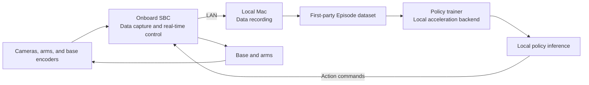

# Household Embodied-Intelligence Training Platform Proposal Under ¥10,000

> Version: V0.2
> Date: 2026-08-09
> Budget ceiling: RMB 10,000 (excluding the existing Mac)

Related document: [Training and Realistic-Environment Plan](./training-and-simulation-plan.md); the training architecture follows [Foundation-Model Perception, World Models, and Imagination Reinforcement Learning Paradigm](./foundation-world-model-training-paradigm.md).

## 1. Proposal Conclusion

Within a ¥10,000 budget, the platform is positioned as a “low-cost mobile manipulation research platform,” not as a general-purpose household robot ready for direct use in homes.

The first version retains the following complete loop:

1. a four-wheel mobile chassis;
2. a head RGB-D camera and left/right wrist RGB cameras;
3. two low-cost arms with joint feedback and grippers;
4. dual-arm joint control and independent safety filtering;
5. an in-house data specification and local policy training;
6. local inference, real-robot evaluation, failed-data feedback, and retraining.

To meet the budget, the electric lift column, lidar, six-axis force sensors, and onboard GPUs such as Jetson must be deferred. The same Actor outputs targets for the chassis and both arms; wheel-speed and low-level joint controllers are responsible only for tracking and safety and may not contain task routes or left/right arm role assignments.

The existing training machine is an Apple M5 Pro with 48 GB of unified memory, which can handle local training and inference for a small visual Actor, a privileged Critic, replay buffers, and parallel simulation. When this proposal was written, the system root volume had about 77 GiB available, so a 1 TB external SSD is mandatory.

This project defines the platform's device interfaces, data formats, policy interface, task orchestration, and safety protocols. Any arm, chassis, training algorithm, or third-party tool may connect only through an adapter and may not become part of the core architecture.

## 2. Phase-One Task

The first end-to-end task is defined as:

> The robot moves from its starting point to the work area, grasps a wide tray or a two-handle storage basket with both arms simultaneously, and transports it stably to a designated area.

This task is selected because it can validate all of the following at once:

- chassis motion and odometry;
- visual localization and work-position alignment;
- concurrent control of the left and right arms in a unified action space;
- time synchronization among images, robot state, and actions;
- expert-free reinforcement learning and real-robot inference;
- failure detection, human takeover, and data feedback.

For the first version, the target object should weigh less than 200 g, and the worktable and storage basket should remain within a fixed height range.

## 3. System Architecture



### 3.1 Onboard Side

The onboard SBC runs Ubuntu and is responsible for:

- capturing the head RGB-D and left/right wrist RGB cameras;
- reading arm joints, grippers, wheel encoders, and the IMU;
- encoding video in hardware or software;
- running the chassis velocity loop;
- receiving arm action chunks and chassis velocities sent by the Mac;
- running the communication watchdog, action limiting, and emergency stop.

The chassis motor-velocity loop, emergency stop, and communication-timeout stop must run on the ESP32-S3 or STM32 and may not depend on the Mac, Wi-Fi, or the learned model.

### 3.2 Mac Side

The Mac is responsible for:

- multimodal data recording and data-quality checks;
- online simulation sampling, replay, and Episode-data generation;
- expert-free Actor-Critic training, evaluation, and model-version management;
- policy inference at 10–15 Hz;
- feedback of evaluation results, failed trajectories, and safety events.

The Mac and robot communicate over a dedicated local network without relying on the internet or cloud services. If the Mac sleeps, the network is interrupted, or the inference process exits, the onboard controller must stop automatically after a timeout and unload high-risk actions.

### 3.3 In-House Core Abstractions

Core code does not directly depend on specific device models and is organized around the following interfaces:

- `ArmDevice`: describes left/right arm capabilities by `arm_id`, reads joint state, position/velocity commands, gripper commands, and stop state;
- `MobileBaseDevice`: reads wheel speed and odometry, chassis velocity commands, and braking state;
- `CameraDevice`: camera intrinsics/extrinsics, image frames, and capture timestamps;
- `SafetyDevice`: emergency stop, watchdog, limits, overcurrent, and fault state;
- `RobotRuntime`: device lifecycle, clock synchronization, observation aggregation, and action dispatch;
- `EpisodeRecorder`: stores raw observations, actions, events, and metadata under the in-house specification;
- `Policy`: receives an observation window and outputs time-bounded action chunks;
- `TaskEvaluator`: reads environment state only, computes rewards, termination, success, and safety outcomes, and outputs no actions.

The common convention uses SI units, radians, a right-handed coordinate system, and monotonic nanosecond timestamps. The robot-body, arm-base, end-effector, and camera frames all belong in a versioned frame tree; calibration results must not be hard-coded into drivers.

Core data objects include:

- `ObservationFrame`: images, joints, grippers, chassis, IMU, and safety state;
- `ActionFrame`: target action, actually dispatched action, validity interval, and source;
- `Episode`: task, frame sequence, events, result, calibration version, and model version;
- `PolicySpec`: observations required by the model, action space, history window, and inference frequency;
- `RobotCapabilities`: sensors, actuators, and control modes available from the current hardware.

Device drivers, algorithm implementations, and data-format converters all belong in the peripheral adapter layer. Replacing an arm or training algorithm must not require changes to the Episode format, task orchestration, or safety module.

### 3.4 Control Layering

The task policy is not split into human navigation, grasping skills, and a state machine. The Actor jointly outputs a 16-dimensional action for the chassis, the left and right six-axis arms, and the left and right grippers; the device side retains only wheel-speed PID, joint servoing, safety limits, and emergency stop. Training curricula may change initial-state difficulty but may not split the task into stages visible to the Actor.

## 4. Hardware Plan and Budget

| Module | Recommended solution | Budget range |
|---|---|---:|
| Dual arms | Two low-cost 5–6-axis arms with joint feedback and grippers | ¥3,200–4,000 |
| Four-wheel chassis | Metal 4WD, four geared motors with encoders | ¥600–900 |
| Onboard computing | Orange Pi 5 or Raspberry Pi 5, 8 GB RAM | ¥600–900 |
| Real-time control | ESP32-S3/STM32, dual motor driver, encoder interface | ¥250–400 |
| Cameras | One head RGB-D camera, two wrist RGB cameras | ¥600–900 |
| Battery and power | 12 V battery, BMS, fuse, 5 V/12 V DC-DC | ¥450–700 |
| Safety and auxiliary sensors | Emergency stop, IMU, bumper or short-range ToF | ¥200–350 |
| Mechanical structure | Enclosure, dual-arm mounts, camera mounts, and 3D-printed parts | ¥350–550 |
| Data storage | 1 TB external SSD | ¥450–600 |
| Cables, router, and spares | Servo cables, tires, fasteners, spare drivers, etc. | ¥400–600 |
| **Total** |  | **¥7,100–9,900** |

The budget ceiling has no room for overruns. Procurement should target approximately ¥9,000, reserving about ¥1,000 for shipping, failed prints, and damaged spares. If any individual item exceeds budget, prioritize dual-arm feedback, encoders, emergency stop, and the external SSD; the depth camera, lidar, and cosmetic parts can all be deferred.

### 4.1 Arm Constraints

At this stage, no arm model is specified; only the minimum capabilities required for platform integration are defined:

- at least 5 controllable joints and an end-effector gripper;
- the ability to read absolute positions or positions that can be reset reliably for every joint;
- support for position commands and state feedback at a minimum of 20 Hz;
- the ability to read communication faults, overload, or disabled state;
- a public or encapsulatable control protocol;
- controller-side joint limits, speed limits, and timeout stop;
- both arms integrated through the same interface with different `arm_id` values, without assuming a particular brand or model;
- a total budget ceiling of ¥4,000 for both arms and grippers.

Model selection takes place after the interfaces, data specification, and simulation stub driver have been validated. Candidate hardware must first pass the `ArmDevice` compatibility test before entering the procurement decision.

### 4.2 Chassis

The chassis uses four-wheel differential/skid steering and does not use mecanum wheels. Suggested first-version parameters:

- chassis dimensions of approximately 300–400 mm;
- four geared motors with encoders;
- a low-speed operating limit of 0.3 m/s;
- battery placed on the lowest level as ballast;
- fixed arm columns near the chassis center;
- chassis speed and rotational speed limits when the arms are extended.

The small arms' reach and payload are limited within the budget, so fixed columns can be optimized for only one work height and cannot cover both the floor and a standard kitchen countertop.

### 4.3 Cameras and Localization

Three-camera layout:

- head RGB-D: mounted above the enclosure, providing global RGB and metric depth;
- left/right wrist RGB: mounted near the two grippers, respectively, providing local manipulation views.

AprilTag is used only for calibration and system identification, not as a privileged target input for the task route or Actor. Simulation and the real robot reuse the same RGB-D alignment, depth cleanup, and camera-validity preprocessing contract.

## 5. Local Training Loop

The platform automatically runs the following loop:

1. procedurally sample scenes, tasks, natural-language expressions, and randomization parameters;
2. have the current dual-arm Actor explore autonomously and save transitions;
3. automatically check dropped frames, timestamp jumps, frozen cameras, out-of-range actions, and safety events;
4. have the environment compute rewards, termination, success, and safety outcomes;
5. write real transitions to autonomous replay and perform asymmetric Actor-Critic updates;
6. periodically reload the deployment Actor and run closed-loop evaluation on isolated seeds;
7. feed back failures and novel states, and automatically adjust curriculum difficulty based on success rate;
8. after the gates are met, generate the model, videos, lineage, and dual-arm ablation report.

Here, “closed-loop training” means that the local machine automatically completes “exploration → outcome determination → replay → reinforcement learning → hidden evaluation → failure feedback.” The model does not update weights online during a single real-robot execution, avoiding unpredictable changes in the real-robot policy while it is moving.

### 5.1 Recommended Sampling Configuration

| Data | Frequency or specification |
|---|---|
| Environment/wrist RGB | 640×480, 30 fps |
| Training input images | Crop or resize to 224×224 or 320×240 |
| Arm state and actions | 30 Hz |
| Chassis odometry and IMU | 50 Hz |
| Policy inference | 10–15 Hz, using action chunking |
| Low-level motor control | At least 100 Hz |
| Communication watchdog | Stop within 200–500 ms |

### 5.2 Data Fields

Record at least the following for every frame:

- monotonic clock timestamp;
- head and left/right wrist RGB images;
- six-axis joint position/velocity and gripper state for both arms;
- current Actor output and the actual action after safety filtering;
- target wheel speeds, actual wheel speeds, and encoders for both sides;
- IMU;
- current task text;
- human-takeover marker;
- Episode reward, termination, success, and safety outcome;
- calibration version, robot ID, and model version;
- safety events such as emergency stop, overcurrent, and communication timeout.

Raw data is append-only and never overwritten. Results of cleaning, cropping, and augmentation are saved as derived datasets, with their source Episodes recorded.

### 5.3 In-House Data Storage

An Episode is a first-class platform object. The following logical layout is recommended:

```text
dataset/
├── manifest.json
├── schema.json
├── episodes.parquet
├── frames/
│   └── part-*.parquet
├── media/
│   └── <episode_id>/<camera_id>.mp4
├── events/
│   └── <episode_id>.jsonl
└── calibrations/
    └── <calibration_id>.json
```

Use Parquet for low-dimensional time-series data, MP4 for video, and JSON Lines for events. The top-level manifest records the schema version and content checksums. Import or export third-party data formats through independent converters; the in-house Episode format remains the system's sole internal source of truth.

### 5.4 Model Route

The first version implements a small vision-language dual-arm Actor and two privileged training-time Critics, without defining any particular paper algorithm or external framework as a platform interface. A policy only needs to implement the unified `Policy` protocol; the trainer obtains input/output constraints through `PolicySpec`.

Recommended order:

1. connect the 16-dimensional joint action for the chassis, left/right arms, and left/right grippers;
2. begin online exploration with the complete task under simplified randomization;
3. add replay that stores only autonomous transitions and an automatic task-agnostic curriculum;
4. add variation in object positions, backgrounds, lighting, and camera noise;
5. add left/right mirroring and tasks that physically require concurrent use of both arms;
6. enter real-robot testing only after passing hidden seeds, unseen language expressions, and single-arm-lockout ablations.

Visual and language encoders may use local pretrained weights, but expert data with action answers and teacher checkpoints are prohibited. A large model is not a prerequisite for first-version acceptance.

## 6. Implementation Plan

### Phase A: Platform Core (Weeks 1–3)

- define device interfaces, coordinate frames, timestamps, and the error model;
- define the Observation, Action, Episode, and Policy schemas;
- implement simulation stub drivers for the cameras, arms, chassis, and safety module;
- implement the minimum local loop for recording, replay, training, evaluation, and model registration;
- use synthetic data to validate data-version migration and action-replay consistency.

Phase exit: run the “observation → recording → training → inference → replay” pipeline end to end without binding it to a real hardware model.

### Phase B: Four-Wheel Chassis (Weeks 4–5)

- select the arms, chassis, and cameras according to the capability interfaces;
- implement hardware adapters for each selected device;
- complete the chassis electronics, encoders, PID, and emergency stop;
- integrate the IMU and communication watchdog;
- validate chassis velocity, the 6D end-effector twist in the left/right arm base frames, and the 16-dimensional joint-action semantics for the left/right grippers, then have the device adapter convert them into joint-servo targets;
- complete the local-network links among the Mac, onboard SBC, and MCU.

Phase exit: all actuators can be independently controlled through unified actions, 30 consecutive basic motions complete without collision, and a communication disconnection causes an automatic stop.

### Phase C: Dual-Arm Mobile Manipulation Loop (Weeks 6–8)

- mount the left and right arms on the two sides of the enclosure and complete camera calibration;
- deploy a single Actor covering the chassis and both arms, without chaining a human task state machine;
- automatically record evaluation Episodes and human takeovers;
- complete multiple rounds of failed-data feedback, simulation-distribution correction, and retraining;
- perform left-arm and right-arm lockout ablations for dual-arm-required tasks.

Phase exit: complete-task success rate reaches 70% in the controlled dual-arm scene, falls below 10% after locking either arm, and 50 consecutive runs complete without collision.

## 7. Acceptance Metrics

| Metric | First-version target |
|---|---:|
| Fixed-scene dual-arm contact-manipulation success rate | ≥ 80% |
| Complete dual-arm mobile-manipulation task success rate | ≥ 70% |
| Dual-arm task success rate after locking either arm | < 10% |
| Final work-position error | ≤ 30 mm |
| Human-takeover rate during evaluation tasks | 0% |
| Automatic stop on communication interruption | 100% |
| Consecutive collision-free runs | 50 tasks |
| Whether training, data, and models depend on the cloud | No |

Success rates must be computed on independent evaluation Episodes not used for training; do not report only replay results from training data.

## 8. Safety Design

- install a physical emergency stop that directly cuts power to the chassis motors and arms;
- have the MCU set an expiration time for every velocity command and automatically zero it on timeout;
- limit first-version chassis speed to 0.3 m/s;
- have the arm policy output positions or position increments, not motor torques directly;
- configure soft limits, per-step action limits, and target-rate limits for every joint;
- prohibit high-speed chassis turning when the arms are extended;
- keep personnel within reach of the emergency stop during training and evaluation;
- do not run automatic evaluation near children, pets, or freely moving people;
- equip the battery with a fuse, BMS, fixed mount, and independent charging procedure.

## 9. Capabilities Excluded from the First Version

- markerless whole-home SLAM and long-term autonomous navigation;
- full-height coverage from the floor to tabletops and high cabinets;
- manipulation of heavy objects, liquids, knives, heat sources, and fragile items;
- reliable door opening, pulling heavy drawers, and loading dishwashers;
- commercial-grade functional safety and unattended operation;
- local pretraining of a large VLA;
- real-time model-weight updates during real execution.

## 10. Upgrade Order

If the budget increases later, upgrade in the following order:

1. more stable arm structures and grippers;
2. 2D lidar;
3. RGB-D environment cameras;
4. an electric lift column and wider chassis;
5. six-axis force sensors or tactile sensors;
6. onboard GPU inference;
7. higher-payload collaborative arms.

## 11. Architecture Boundaries

- the core layer does not reference specific robot models, vendor SDKs, or third-party data formats;
- the core layer is unaware of whether the training device is a CPU, Apple GPU, or another accelerator;
- hardware differences are absorbed by device adapters and `RobotCapabilities`;
- algorithm differences are absorbed by `Policy`, `PolicySpec`, and trainer plugins;
- transport-protocol differences are absorbed by runtime communication adapters;
- third-party code may be used for peripheral implementation but may not redefine core objects or lifecycles in reverse;
- the safety supervisor is independent of the policy, and no model may bypass action filtering, limits, or the emergency stop.
