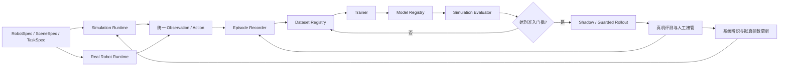

# 家务具身智能平台训练与拟真环境方案

> 版本：V0.1  
> 日期：2026-08-09  
> 前置方案：[万元内家务具身智能训练平台方案](./low-cost-platform-proposal.md)

## 1. 目标

本方案定义从拟真环境、数据生成、策略训练到真机回流的完整闭环。当前阶段不绑定具体机械臂、机器人套件、仿真引擎或外部机器人学习框架。

平台需要做到：

1. 在没有真实硬件的情况下开发和验证任务、数据及策略接口；
2. 使用同一套 Observation、Action、Episode 和 Policy 定义连接仿真与真机；
3. 在本机完成数据生成、训练、评测、模型注册和回放；
4. 用真实测量逐步校准拟真环境，而不是追求纯视觉上的“像”；
5. 允许替换物理引擎、机械臂、底盘和算法，而不修改核心数据与任务定义；
6. 将安全监督、任务编排与学习策略解耦。

## 2. 核心原则

### 2.1 自有规范是唯一事实来源

项目自己定义：

- 机器人能力和坐标系；
- 观测与动作空间；
- Episode 数据格式；
- 场景与任务描述；
- 随机化参数；
- 策略接口；
- 训练运行、模型和评测结果；
- 仿真与真机的生命周期。

第三方物理引擎、训练库、模型实现和数据格式只能通过适配器接入。

### 2.2 仿真与真机使用同一任务接口

任务代码不能通过条件分支分别实现“仿真版本”和“真机版本”。二者都必须暴露统一的：

- `reset()`：准备一个新 Episode；
- `observe()`：返回统一观测；
- `apply(action)`：提交带有效期的动作；
- `events()`：返回碰撞、超时、接管等事件；
- `result()`：返回任务结果和指标；
- `close()`：安全释放资源。

### 2.3 先保证因果一致，再提升画面真实度

拟真建设顺序是：

1. 坐标、单位和时间一致；
2. 运动学和动作语义一致；
3. 控制频率、延迟、死区和限位一致；
4. 接触、摩擦和物体动力学一致；
5. 相机成像与视觉外观接近；
6. 扩展场景多样性。

如果仿真中的动作含义与真机不同，再真实的画面也不能缩小 Sim-to-Real 差距。

## 3. 总体训练架构



训练平台分为八个自有模块：

| 模块 | 职责 |
|---|---|
| `hwr-spec` | Robot、Scene、Task、Sensor、Action 的版本化规范 |
| `hwr-runtime` | 生命周期、时钟、观测聚合、动作下发和故障传播 |
| `hwr-sim` | `SimBackend` 接口、拟真参数和仿真适配器 |
| `hwr-data` | Episode 录制、校验、索引、切分和版本迁移 |
| `hwr-policy` | 策略协议、预处理、后处理和模型插件 |
| `hwr-train` | 训练循环、检查点、实验记录和本机加速后端 |
| `hwr-eval` | 离线、仿真、影子和真机评测 |
| `hwr-safety` | 动作过滤、限位、看门狗、急停和安全事件 |

## 4. 自有技术栈

### 4.1 核心语言与格式

- Python：任务、仿真编排、数据处理、训练和评测；
- C/C++：未来的 MCU 控制、安全看门狗和高频电机环；
- Protobuf：在线 Observation、Action、Event 和 Capability 消息；
- gRPC 双向流：本机、仿真进程与机器人运行时之间的控制通信；
- JSON：可读配置、manifest 和标定元数据；
- Parquet：低维时序状态、动作和 Episode 索引；
- MP4：相机视频；
- SHA-256：资产、数据集、配置和模型内容校验。

### 4.2 训练后端

首版提供一个基于张量计算库的参考训练器，并在现有 Mac 上使用本机 GPU 加速。核心 `Policy` 和 `Trainer` 协议不暴露具体计算设备，模型插件通过 `cpu`、`local_gpu` 等逻辑设备名申请资源。

训练产物必须包含：

- 模型权重；
- `PolicySpec`；
- 预处理和后处理参数；
- 数据集版本；
- 训练配置；
- 源代码提交 ID；
- 随机种子；
- 离线及仿真评测结果。

### 4.3 仿真后端

项目定义 `SimBackend`，物理引擎只是其实现细节。参考后端必须满足：

- 支持 macOS 本机运行；
- 支持无界面批量运行；
- 支持刚体、关节、接触、摩擦和相机；
- 支持固定随机种子的可重复 reset；
- 能读取接触、关节、物体位姿和碰撞事件；
- 能注入控制延迟、传感器噪声和参数随机化；
- 资产和场景可由项目规范生成；
- 许可证允许长期使用和修改适配器。

具体物理引擎在 PoC 基准测试后通过架构决策记录确定，不进入核心对象命名和数据 schema。

## 5. 核心协议

### 5.1 RobotSpec

`RobotSpec` 描述机器人能力，不描述某个厂商 SDK：

```yaml
schema_version: hwr.robot/v1
robot_id: mobile_manipulator_v0
frames:
  - world
  - odom
  - base_link
  - arm_base
  - end_effector
joints: []
actuators: []
sensors: []
control_modes:
  - base_twist
  - arm_joint_position
  - end_effector_delta_pose
  - gripper_position
safety_limits: {}
```

机器人规格还需要记录：

- 关节类型、轴向、范围和零位；
- 执行器控制频率、最大速度和最大加速度；
- 碰撞几何和视觉几何资产；
- 传感器内外参及采样频率；
- 底盘运动学；
- 可用控制模式；
- 安全边界。

### 5.2 SceneSpec

`SceneSpec` 描述场景组成：

```yaml
schema_version: hwr.scene/v1
scene_id: mobile_pick_place_room_v0
world:
  gravity: [0.0, 0.0, -9.81]
entities: []
lighting: []
spawn_regions: []
materials: []
markers: []
```

场景中的每个实体必须有稳定 ID、坐标系、资产版本、语义类别、碰撞属性和可随机化参数。

### 5.3 TaskSpec

`TaskSpec` 将任务从策略代码中分离：

```yaml
schema_version: hwr.task/v1
task_id: move_align_pick_place_v0
initialization: {}
observations: []
actions: []
stages: []
success_conditions: []
failure_conditions: []
termination_conditions: []
metrics: []
curriculum: []
randomization_profile: train_v0
```

任务成功与失败必须用可计算条件定义，不能依赖操作员主观判断。例如：

- 目标物最终中心位于收纳区域内；
- 目标物在区域内稳定超过 1 秒；
- 机器人无禁区碰撞；
- 任务在时间上限内完成；
- 未触发急停或人工接管。

### 5.4 Observation

统一观测包含：

- `timestamp_ns`：单调纳秒时钟；
- `sequence_id`：连续帧编号；
- `images`：相机 ID 到图像帧的映射；
- `joint_state`：位置、速度、可选电流或力矩；
- `gripper_state`；
- `base_state`：轮速、里程计和底盘速度；
- `imu_state`；
- `task_state`：任务 ID、阶段和目标；
- `safety_state`；
- `quality`：丢帧、时间同步和传感器健康度。

### 5.5 Action

统一动作包含：

- `created_at_ns`；
- `valid_from_ns` 和 `valid_until_ns`；
- `source`：遥操作、策略、恢复控制器或安全模块；
- `base_twist`；
- `arm_joint_target` 或 `end_effector_delta_pose`；
- `gripper_target`；
- `confidence`；
- `policy_version`。

每次下发同时保存“策略原始动作”“安全过滤后动作”和“执行器实际状态”，便于定位策略、控制和硬件之间的误差。

### 5.6 Policy

策略协议：

```python
class Policy:
    def spec(self) -> PolicySpec: ...
    def reset(self, context: EpisodeContext) -> None: ...
    def infer(self, window: ObservationWindow) -> ActionChunk: ...
    def close(self) -> None: ...
```

`ActionChunk` 包含未来若干控制步以及每一步的目标执行时间。安全模块有权裁剪、拒绝或终止任何策略动作。

## 6. 拟真环境建设

### 6.1 首个环境范围

首个拟真环境只覆盖一个 3 m × 4 m 的受控房间：

- 平整地面；
- 一个固定高度工作台或低柜；
- 一个收纳篮；
- 3～5 种小型、低风险目标物；
- 起点区域；
- 工作位对准标记；
- 墙体、桌腿和禁入区；
- 两路机器人相机；
- 可调整的光源和背景材质。

首版不建完整住宅，也不加入开门、楼梯、地毯、液体和柔性衣物。先把单个移动抓放任务的运动、接触、数据和评测闭环做可靠。

### 6.2 拟真分级

| 等级 | 内容 | 用途 |
|---|---|---|
| S0 接口环境 | 假时钟、假传感器、预定义状态转移 | 验证协议、录制和回放 |
| S1 运动学环境 | 关节和底盘运动学，无真实接触 | 验证坐标、动作和任务逻辑 |
| S2 刚体环境 | 重力、碰撞、摩擦、夹取和掉落 | 训练与评测操作策略 |
| S3 传感器环境 | 相机模型、延迟、噪声、丢帧 | 训练视觉策略 |
| S4 随机化环境 | 外观、动力学、布局和时序随机化 | 提升 Sim-to-Real 鲁棒性 |
| S5 校准环境 | 使用真机测量更新参数分布 | 缩小仿真与真机差距 |

每一级都必须通过验收后再增加复杂度，不能用复杂场景掩盖基础坐标或控制错误。

### 6.3 机器人数字孪生

数字孪生需要包含：

- 底盘尺寸、轮径、轮距和质量分布；
- 机械臂关节链、限位、质量和惯量；
- 夹爪几何、开合范围和接触面；
- 视觉网格与简化碰撞网格；
- 电机速度、加速度、死区、回差和响应延迟；
- 相机内参、畸变、安装位姿和曝光参数；
- 控制和传感器频率；
- 网络延迟及抖动。

真实硬件确定前，数字孪生使用参数化占位机器人。占位模型的关节数、控制模式和传感器接口覆盖目标能力，但尺寸、质量和动力学只用于开发，不作为最终训练参数。

### 6.4 资产流程

每个资产包含：

- `asset.json`：ID、版本、单位、原点和语义；
- 可渲染网格；
- 简化碰撞网格；
- 质量、惯量和材料参数；
- 抓取区域或禁抓区域；
- 纹理集合；
- 内容校验值。

资产进入训练集前需要自动检查：

- 单位是否为米；
- 坐标轴和原点是否符合规范；
- 网格是否封闭或存在异常面；
- 碰撞网格复杂度是否超限；
- 惯量矩阵是否有效；
- 视觉和碰撞包围盒差异是否合理。

### 6.5 相机拟真

相机模型至少模拟：

- 分辨率、帧率和视场角；
- 径向与切向畸变；
- 曝光、白平衡、亮度和对比度；
- 高斯噪声、压缩伪影和运动模糊；
- 随机丢帧和时间戳抖动；
- 相机外参小幅漂移；
- 遮挡、反光和阴影变化。

训练数据保存原始拟真帧；裁剪、缩放和归一化由策略预处理配置完成，不能固化在环境中。

### 6.6 动力学随机化

初始随机化范围只做保守扰动：

- 物体质量：标称值 ±10%；
- 接触摩擦：标称值 ±20%；
- 轮径和轮距：标称值 ±2%；
- 关节零点：小范围偏移；
- 电机响应和动作延迟：在测得范围内采样；
- 相机外参：位置和角度小范围扰动；
- 控制频率：注入少量抖动；
- 物体初始位姿、光照、纹理和背景变化。

真实硬件接入后，所有范围用系统辨识数据更新。随机化不是越大越好；过宽会使策略学习过度保守或忽略有效视觉特征。

### 6.7 系统辨识

真机接入后的基础测量包括：

- 轮速阶跃响应和直线/原地旋转轨迹；
- 关节位置阶跃、最大速度、回差和静态偏置；
- 动作下发到状态变化的端到端延迟；
- 相机采集延迟、帧间隔和曝光变化；
- 常见物体的滑动、滚动和夹持结果；
- 机械臂伸出时的底盘姿态和振动。

每次辨识生成版本化 `CalibrationProfile`。训练运行必须记录使用的 profile，禁止直接修改仿真默认值而不留版本。

## 7. 数据生成方案

### 7.1 数据来源

平台支持四类数据：

1. 规则专家：通过已知物体状态生成基准动作；
2. 仿真遥操作：验证任务和低成本生成多样示范；
3. 真机遥操作：提供真实视觉、动力学和人为纠错；
4. 策略执行：收集成功、失败、恢复和人工接管轨迹。

所有来源使用同一 Episode schema，并通过 `source_type` 区分。

### 7.2 数据阶段

第一阶段建议数据规模：

- S1/S2 低维验证：1,000～5,000 个仿真 Episode；
- S3/S4 视觉预训练：5,000～20,000 个仿真 Episode；
- 真机基线：200～500 个高质量示范 Episode；
- 每轮闭环：新增 50～100 个针对失败分布的 Episode；
- 独立评测集：至少 100 个仿真场景和 50 次真机运行。

这些数量是规划配额，不是训练成功的充分条件。是否继续扩充由学习曲线、场景覆盖率和失败聚类决定。

### 7.3 数据质量门槛

Episode 进入训练集前必须通过：

- 所有必需模态存在；
- 时间戳严格单调；
- 图像与状态同步误差低于配置门槛；
- 动作有效期完整；
- 无未标记的急停、通信中断或人工接管；
- RobotSpec、TaskSpec 和 CalibrationProfile 可追溯；
- 结果标签和终止原因完整；
- 内容校验值正确。

失败 Episode 不删除，而是进入独立失败集，供恢复策略、难例采样和诊断使用。

### 7.4 数据切分

训练、验证和测试按 Episode、场景种子、物体实例和布局切分，禁止随机拆分单帧。测试集至少包含：

- 未参与训练的物体位置；
- 未参与训练的纹理和光照；
- 参数分布边缘值；
- 轻度遮挡和延迟；
- 恢复场景。

## 8. 策略训练方案

### 8.1 首版策略边界

首版不训练一个策略完成全屋导航和抓放。采用：

- 规则或经典控制技能：移动到工作区、低速对准、安全停止；
- 学习型操作技能：接近目标、抓取、搬运、放置；
- 任务状态机：串联技能并处理超时、失败和恢复。

### 8.2 策略输入

- 环境相机最近若干帧；
- 腕部相机最近若干帧；
- 关节和夹爪状态；
- 底盘低维状态；
- 当前任务阶段和目标 ID；
- 上一个实际执行动作；
- 可选的图像质量与安全状态。

### 8.3 策略输出

首版输出未来若干步的：

- 关节位置增量或末端位姿增量；
- 夹爪目标；
- 动作置信度；
- 可选的技能完成概率。

底盘速度暂不由操作策略输出。移动操作联合训练在机械臂策略稳定后单独立项。

### 8.4 基线模型

首版实现动作分块视觉行为克隆模型：

- 图像编码器提取两路视觉特征；
- 状态编码器处理关节、夹爪和任务阶段；
- 时序模块融合历史观测；
- 动作头预测未来 8～16 个控制步；
- 夹爪可使用独立离散或连续输出头。

参考损失：

- 连续动作 Huber 或 L1 损失；
- 夹爪状态损失；
- 动作平滑损失；
- 越界动作惩罚；
- 可选的技能完成辅助损失。

模型实现是 `Policy` 插件，不修改数据或运行时协议。

### 8.5 训练配置

- 输入图像：224×224 或 320×240；
- 观测历史：2～4 帧起步；
- 动作块长度：8～16 步；
- 推理频率：10～15 Hz；
- 混合精度：由本机后端能力决定；
- 早停依据：闭环仿真成功率，不只看验证损失；
- 每次训练至少运行 3 个随机种子的小规模对照；
- 最终候选模型必须完成固定场景集评测。

### 8.6 仿真和真实数据混合

建议训练顺序：

1. 用仿真数据验证模型能够学习任务；
2. 用随机化仿真数据进行视觉与动作预训练；
3. 加入少量真机数据进行微调；
4. 提高真机数据采样权重；
5. 用失败和人工接管数据进行难例再训练。

不固定一个永久混合比例。平台按数据来源、任务阶段和失败类型配置采样器，并通过真实评测选择比例。

## 9. 本机闭环流程

### 9.1 训练前

1. 校验 RobotSpec、SceneSpec 和 TaskSpec 版本；
2. 校验数据集完整性和切分泄漏；
3. 生成不可变训练 manifest；
4. 记录代码版本、配置、种子和本机环境；
5. 估算磁盘空间和训练内存。

### 9.2 训练中

- 周期保存检查点和优化器状态；
- 记录训练/验证损失、吞吐和内存；
- 定期执行小规模闭环仿真；
- 出现 NaN、数据中断或 schema 不匹配时立即失败；
- 不自动覆盖已有模型版本。

### 9.3 训练后

1. 在冻结测试集上离线评测；
2. 在固定仿真场景集上闭环评测；
3. 在随机化压力场景上评测；
4. 生成模型卡和失败聚类报告；
5. 达到准入门槛后进入影子执行；
6. 通过影子执行后才能进行低速真机评测。

## 10. 评测体系

### 10.1 离线指标

- 动作位置误差；
- 夹爪状态准确率；
- 动作平滑度；
- 多步动作漂移；
- 推理延迟和抖动；
- 越界动作比例。

离线动作误差只能用于诊断，不能代替闭环成功率。

### 10.2 仿真闭环指标

- 任务成功率；
- 抓取成功率和放置成功率；
- 平均完成时间；
- 目标物掉落率；
- 机器人和环境碰撞次数；
- 关节/速度限位触发次数；
- 恢复成功率；
- 在随机化参数上的最差分位表现。

### 10.3 Sim-to-Real 指标

- 相同动作下的关节轨迹误差；
- 底盘轨迹误差；
- 相机重投影误差；
- 动作端到端延迟差；
- 物体运动结果差异；
- 仿真与真机任务成功率差值。

### 10.4 模型准入门槛

模型进入真机前必须满足：

- 固定仿真测试集成功率不低于 85%；
- 随机化测试集成功率不低于 70%；
- 禁区碰撞率为 0；
- 动作越界经安全过滤前低于 0.1%；
- 单次推理延迟满足控制周期；
- 所有模型文件、配置和数据版本可追溯。

真机首轮以低速、软物体、空载夹爪和人员可触达急停为前提。

## 11. 拟真验收门槛

### 硬件确定前

- 坐标变换测试全部通过；
- 固定种子能够确定性重放任务初始状态；
- 同一 Action 在 S0～S3 中具有相同语义；
- Episode 可以在仿真运行时和回放器间无损往返；
- 任务成功、失败和终止条件有单元测试；
- 仿真后端可以被替换而不修改 TaskSpec。

### 硬件接入后

- 相机标定重投影误差达到项目门槛；
- 关节和底盘阶跃响应误差进入辨识目标范围；
- 仿真和真机动作延迟分布接近；
- 常见物体的滑动和夹持结果落入同一统计区间；
- 仿真与真机成功率差值逐轮缩小。

具体数值在硬件测量后写入 `CalibrationProfile` 和验收配置，避免在缺少测量时伪造精度。

## 12. 建议仓库结构

```text
50-housework-robot/
├── docs/
├── schemas/
│   ├── robot/
│   ├── scene/
│   ├── task/
│   ├── episode/
│   └── policy/
├── packages/
│   ├── hwr-spec/
│   ├── hwr-runtime/
│   ├── hwr-sim/
│   ├── hwr-data/
│   ├── hwr-policy/
│   ├── hwr-train/
│   ├── hwr-eval/
│   └── hwr-safety/
├── configs/
│   ├── robots/
│   ├── scenes/
│   ├── tasks/
│   ├── randomization/
│   └── training/
├── assets/
│   ├── robots/
│   ├── furniture/
│   └── objects/
├── datasets/
├── models/
├── runs/
└── tests/
```

大型数据、视频、模型和生成资产不提交到 Git；仓库只保存 schema、manifest、配置、代码和小型测试样本。

## 13. 实施阶段

### T0：规范冻结（第 1 周）

- 冻结 Observation、Action、Episode V1；
- 冻结 RobotSpec、SceneSpec、TaskSpec V1；
- 定义错误码、事件和版本迁移原则；
- 建立 schema 验证与兼容性测试。

交付物：schema、接口文档、测试样例。

### T1：S0/S1 环境（第 2～3 周）

- 实现假设备和确定性时钟；
- 实现参数化占位机器人；
- 实现移动抓放任务状态机；
- 打通 Episode 录制、回放和结果计算。

交付物：可重复的无物理闭环和运动学闭环。

### T2：S2/S3 拟真（第 4～5 周）

- 接入参考刚体物理后端；
- 构建房间、工作台、收纳篮和小物体资产；
- 加入碰撞、摩擦、夹取、掉落和两路相机；
- 加入延迟、噪声和丢帧模型。

交付物：可以批量生成视觉移动抓放 Episode 的环境。

### T3：训练基线（第 6～7 周）

- 实现动作分块行为克隆策略；
- 实现训练、检查点和模型注册；
- 建立固定测试场景与随机化压力测试；
- 在本机完成第一轮视觉策略训练。

交付物：仿真闭环成功率报告和可回放模型。

### T4：硬件适配与校准（硬件确定后）

- 按能力接口选择机械臂、底盘和相机；
- 实现硬件适配器；
- 完成相机、关节、底盘和延迟系统辨识；
- 生成第一版 CalibrationProfile；
- 更新仿真参数分布。

交付物：同一 TaskSpec 在仿真与真机运行。

### T5：真机闭环

- 采集真机示范；
- 仿真预训练和真机微调；
- 影子执行、低速执行和人工接管；
- 失败聚类、定向补采和再训练；
- 生成 Sim-to-Real 差距报告。

交付物：受控场景移动抓放真机成功率报告。

## 14. 主要风险

| 风险 | 应对方式 |
|---|---|
| 过度追求画面真实 | 先验收坐标、时序、动作和接触一致性 |
| 仿真策略真机失效 | 系统辨识、保守随机化、真机微调、接管回流 |
| 仿真引擎反向污染架构 | 所有调用限制在 `SimBackend` 适配层 |
| 硬件选型改变动作空间 | 通过 Capability 和 PolicySpec 协商，不修改 Episode 核心 |
| 合成数据压过真实数据 | 来源分层采样，由真机评测决定混合比例 |
| 训练和渲染争抢本机资源 | 数据生成与训练分时运行，缓存已生成视频 |
| 时间同步问题被误认为模型问题 | 对采集、接收、推理、下发、执行分别打时间戳 |
| 任务跨度过大 | 先做移动对准与抓放两个技能，再组合任务 |

## 15. 当前阶段决策

当前立即推进：

1. 自有 schema 和核心协议；
2. S0/S1 假设备与运动学环境；
3. 参数化占位机器人；
4. 移动抓放 TaskSpec；
5. Episode 录制和确定性回放；
6. 仿真后端 PoC 与选型基准。

当前明确不推进：

- 具体机械臂型号；
- 机械臂采购和组装；
- 针对某个外部训练框架的数据格式；
- 完整住宅建模；
- 大模型或全屋端到端策略。

