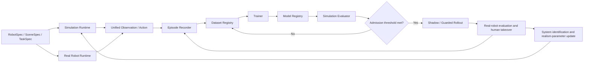

# Training and Simulation-Environment Plan for a Household Embodied-Intelligence Platform

> Version: V0.1
> Date: 2026-08-09
> Prerequisite proposal: [Household Embodied-Intelligence Training Platform Proposal Under RMB 10,000](./low-cost-platform-proposal.md)

## 1. Objectives

This plan defines the complete loop from the simulation environment, data generation, and policy
training to real-robot feedback. At this stage it does not bind the project to a specific arm,
robot kit, simulation engine, or external robot-learning framework.

The platform must:

1. Develop and validate task, data, and policy interfaces without real hardware;
2. Connect simulation and the real robot with one shared definition of Observation, Action, Episode, and Policy;
3. Complete data generation, training, evaluation, model registration, and replay locally;
4. Calibrate the simulation environment progressively with real measurements rather than pursuing visual “likeness” alone;
5. Allow the physics engine, arm, base, and algorithm to be replaced without changing core data or task definitions;
6. Decouple safety supervision and task orchestration from learned policies.

## 2. Core Principles

### 2.1 Project-Owned Specifications Are the Single Source of Truth

The project defines:

- Robot capabilities and coordinate frames;
- Observation and action spaces;
- Episode data format;
- Scene and task descriptions;
- Randomization parameters;
- Policy interfaces;
- Training runs, models, and evaluation results;
- Simulation and real-robot lifecycles.

Third-party physics engines, training libraries, model implementations, and data formats may
enter only through adapters.

### 2.2 Simulation and the Real Robot Use the Same Task Interface

Task code must not implement separate “simulation” and “real-robot” versions through conditional
branches. Both must expose:

- `reset()`: prepare a new Episode;
- `observe()`: return the unified observation;
- `apply(action)`: submit an action with a validity period;
- `events()`: return events such as collisions, timeouts, and takeovers;
- `result()`: return task results and metrics;
- `close()`: release resources safely.

### 2.3 Ensure Causal Consistency Before Visual Realism

Build simulation fidelity in this order:

1. Consistent coordinates, units, and time;
2. Consistent kinematics and action semantics;
3. Consistent control frequency, latency, dead zones, and limits;
4. Consistent contact, friction, and object dynamics;
5. Similar camera imaging and visual appearance;
6. Expanded scene diversity.

If an action means something different in simulation and on the real robot, even highly realistic
visuals cannot narrow the Sim-to-Real gap.

## 3. Overall Training Architecture



The training platform consists of eight project-owned modules:

| Module | Responsibility |
|---|---|
| `hwr-spec` | Versioned specifications for Robot, Scene, Task, Sensor, and Action |
| `hwr-runtime` | Lifecycle, clock, observation aggregation, action dispatch, and fault propagation |
| `hwr-sim` | `SimBackend` interface, fidelity parameters, and simulation adapters |
| `hwr-data` | Episode recording, validation, indexing, splitting, and version migration |
| `hwr-policy` | Policy protocol, preprocessing, postprocessing, and model plugins |
| `hwr-train` | Training loop, checkpoints, experiment records, and local acceleration backends |
| `hwr-eval` | Offline, simulation, shadow, and real-robot evaluation |
| `hwr-safety` | Action filtering, limits, watchdog, emergency stop, and safety events |

## 4. Project-Owned Technology Stack

### 4.1 Core Languages and Formats

- Python: tasks, simulation orchestration, data processing, training, and evaluation;
- C/C++: future MCU control, safety watchdog, and high-frequency motor loop;
- Protobuf: online Observation, Action, Event, and Capability messages;
- Bidirectional gRPC streams: control communication among the local machine, simulation process, and robot runtime;
- JSON: human-readable configuration, manifests, and calibration metadata;
- Parquet: low-dimensional temporal state, action, and Episode indices;
- MP4: camera video;
- SHA-256: content validation for assets, datasets, configuration, and models.

### 4.2 Training Backend

The first version provides a reference trainer based on a tensor-computation library and uses
local GPU acceleration on the existing Mac. The core `Policy` and `Trainer` protocols do not
expose a concrete compute device; model plugins request resources through logical device names
such as `cpu` and `local_gpu`.

Training artifacts must include:

- Model weights;
- `PolicySpec`;
- Preprocessing and postprocessing parameters;
- Dataset version;
- Training configuration;
- Source-code commit ID;
- Random seed;
- Offline and simulation evaluation results.

### 4.3 Simulation Backend

The project defines `SimBackend`; the physics engine is only an implementation detail. The
reference backend must:

- Run locally on macOS;
- Support headless batch execution;
- Support rigid bodies, joints, contact, friction, and cameras;
- Support repeatable reset with a fixed random seed;
- Read contact, joint, object-pose, and collision events;
- Inject control latency, sensor noise, and parameter randomization;
- Generate assets and scenes from project specifications;
- Use a license that permits long-term use and adapter modification.

The concrete physics engine is selected through an architecture decision record after PoC
benchmarks and does not enter core object naming or data schema.

## 5. Core Protocols

### 5.1 RobotSpec

`RobotSpec` describes robot capabilities, not a particular vendor SDK:

```yaml
schema_version: hwr.robot/v1
robot_id: mobile_manipulator_v0
frames:
  - world
  - odom
  - base_link
  - arm_base
  - end_effector
joints: []
actuators: []
sensors: []
control_modes:
  - base_twist
  - arm_joint_position
  - end_effector_delta_pose
  - gripper_position
safety_limits: {}
```

The robot specification must also record:

- Joint types, axes, ranges, and zero positions;
- Actuator control frequency, maximum velocity, and maximum acceleration;
- Collision geometry and visual-geometry assets;
- Sensor intrinsics, extrinsics, and sampling frequency;
- Base kinematics;
- Available control modes;
- Safety boundaries.

### 5.2 SceneSpec

`SceneSpec` describes scene composition:

```yaml
schema_version: hwr.scene/v1
scene_id: mobile_pick_place_room_v0
world:
  gravity: [0.0, 0.0, -9.81]
entities: []
lighting: []
spawn_regions: []
materials: []
markers: []
```

Every scene entity must have a stable ID, coordinate frame, asset version, semantic category,
collision properties, and randomizable parameters.

### 5.3 TaskSpec

`TaskSpec` separates the task from policy code:

```yaml
schema_version: hwr.task/v1
task_id: move_align_pick_place_v0
initialization: {}
observations: []
actions: []
stages: []
success_conditions: []
failure_conditions: []
termination_conditions: []
metrics: []
curriculum: []
randomization_profile: train_v0
```

Task success and failure must be defined by computable conditions rather than operator judgment.
For example:

- The final center of the target object lies inside the storage region;
- The target object remains stable in the region for more than 1 second;
- The robot has no collision with a restricted zone;
- The task completes within the time limit;
- No emergency stop or human takeover is triggered.

### 5.4 Observation

The unified observation contains:

- `timestamp_ns`: Monotonic nanosecond clock;
- `sequence_id`: Sequential frame number;
- `images`: Mapping from camera ID to image frame;
- `joint_state`: Position, velocity, and optional current or torque;
- `gripper_state`;
- `base_state`: Wheel speed, odometry, and base velocity;
- `imu_state`;
- `task_instruction`: Raw natural-language instruction visible to the Actor;
- `safety_state`;
- `quality`: Dropped frames, time synchronization, and sensor health.

Success flags, rewards, environment goals, task progress, and simulation ground truth are stored
in training-time `PrivilegedTransition` and must not enter ActorObservation.

### 5.5 Action

The unified action contains:

- `created_at_ns`;
- `valid_from_ns` and `valid_until_ns`;
- `source`: policy, safety module, or human takeover for debugging only;
- `base_twist`;
- left/right `arm_joint_target` or left/right `end_effector_delta_pose`;
- left/right `gripper_target`;
- `confidence`;
- `policy_version`.

Every dispatch also stores the “raw policy action,” “safety-filtered action,” and “actual
actuator state” to help localize discrepancies among policy, control, and hardware.

### 5.6 Policy

Policy protocol:

```python
class Policy:
    def spec(self) -> PolicySpec: ...
    def reset(self, context: EpisodeContext) -> None: ...
    def infer(self, window: ObservationWindow) -> ActionChunk: ...
    def close(self) -> None: ...
```

`ActionChunk` contains several future control steps and a target execution time for each step.
The safety module may clip, reject, or terminate any policy action.

## 6. Simulation-Environment Construction

### 6.1 Initial Environment Scope

The first simulation environment covers only one controlled 3 m × 4 m room:

- Flat floor;
- A fixed-height workbench or low cabinet;
- A storage basket;
- 3–5 small, low-risk target objects;
- Starting area;
- Work-position alignment markers;
- Walls, table legs, and restricted zones;
- Two robot cameras;
- Adjustable lighting and background materials.

The first version does not model a complete home and does not include doors, stairs, carpets,
liquids, or flexible clothing. First make the motion, contact, data, and evaluation loop for a
single mobile pick-and-place task reliable.

### 6.2 Fidelity Levels

| Level | Contents | Use |
|---|---|---|
| S0 Interface environment | Fake clock, fake sensors, predefined state transitions | Validate protocols, recording, and replay |
| S1 Kinematic environment | Joint and base kinematics without real contact | Validate coordinates, actions, and task logic |
| S2 Rigid-body environment | Gravity, collisions, friction, grasping, and drops | Train and evaluate manipulation policies |
| S3 Sensor environment | Camera model, latency, noise, and dropped frames | Train visual policies |
| S4 Randomized environment | Appearance, dynamics, layout, and temporal randomization | Improve Sim-to-Real robustness |
| S5 Calibrated environment | Update parameter distributions using real-robot measurements | Narrow the simulation-to-real gap |

Each level must pass acceptance before complexity is added; complex scenes must not conceal basic
coordinate or control errors.

### 6.3 Robot Digital Twin

The digital twin must include:

- Base dimensions, wheel diameter, wheel track, and mass distribution;
- Arm joint chain, limits, mass, and inertia;
- Gripper geometry, opening range, and contact surfaces;
- Visual mesh and simplified collision mesh;
- Motor velocity, acceleration, dead zone, backlash, and response latency;
- Camera intrinsics, distortion, mounting pose, and exposure parameters;
- Control and sensor frequencies;
- Network latency and jitter.

Before real hardware is selected, the digital twin uses a parameterized placeholder robot. The
placeholder model covers the target capability in joint count, control modes, and sensor
interfaces, but its dimensions, mass, and dynamics are for development only and are not final
training parameters.

### 6.4 Asset Workflow

Each asset contains:

- `asset.json`: ID, version, units, origin, and semantics;
- Renderable mesh;
- Simplified collision mesh;
- Mass, inertia, and material parameters;
- Graspable or restricted regions;
- Texture set;
- Content checksum.

Before an asset enters the training set, automatically check:

- Whether units are meters;
- Whether axes and origin follow the specification;
- Whether the mesh is closed or contains anomalous faces;
- Whether collision-mesh complexity exceeds the limit;
- Whether the inertia matrix is valid;
- Whether the difference between visual and collision bounding boxes is reasonable.

### 6.5 Camera Fidelity

The camera model must simulate at least:

- Resolution, frame rate, and field of view;
- Radial and tangential distortion;
- Exposure, white balance, brightness, and contrast;
- Gaussian noise, compression artifacts, and motion blur;
- Random dropped frames and timestamp jitter;
- Small extrinsic drift;
- Changes in occlusion, reflections, and shadows.

Training data stores raw simulated-fidelity frames; cropping, resizing, and normalization are
performed by policy preprocessing configuration and must not be hard-coded into the environment.

### 6.6 Dynamics Randomization

Initial randomization ranges use conservative perturbations only:

- Object mass: ±10% of nominal;
- Contact friction: ±20% of nominal;
- Wheel diameter and track: ±2% of nominal;
- Joint zero points: small offsets;
- Motor response and action latency: sample within measured ranges;
- Camera extrinsics: small perturbations in position and angle;
- Control frequency: inject small jitter;
- Variation in initial object pose, lighting, texture, and background.

After real hardware is connected, update all ranges with system-identification data.
Randomization is not better when larger; overly broad ranges can make the policy excessively
conservative or cause it to ignore useful visual features.

### 6.7 System Identification

Basic measurements after connecting the real robot include:

- Wheel-speed step response and straight-line/in-place rotation trajectories;
- Joint-position step response, maximum velocity, backlash, and static bias;
- End-to-end latency from action dispatch to state change;
- Camera-capture latency, frame interval, and exposure variation;
- Sliding, rolling, and grasping outcomes for common objects;
- Base pose and vibration when the arm is extended.

Each identification run generates a versioned `CalibrationProfile`. Training runs must record
the profile used; directly changing simulation defaults without leaving a version is prohibited.

## 7. Data-Generation Plan

### 7.1 Data Sources

Formal training data comes entirely from closed-loop interaction between the current Actor and
the environment. It does not start from rule-based experts, human teleoperation, teacher
policies, or action labels:

1. Online exploration: the current bimanual Actor executes programmatic simulation tasks and produces transitions;
2. Experience replay: retain successful, failed, recovery, collision, and timeout Episodes;
3. Stratified reuse: resample real transitions only by task-agnostic novelty, TD error, reward improvement, and safety/failure outcomes;
4. Legal augmentation: the environment declares legal transformations, and the algorithm applies generic augmentation only at sampling time without storing transformed copies;
5. Hidden evaluation: use only for admission and failure analysis, never feeding it back into the training set.

Historical expert and behavior-cloning data must be marked `legacy` and rejected by training
lineage checks. Future real-robot teleoperation may be used only for safety debugging, system
identification, or emergency-takeover audits; it is not a required source for formal policy training.

### 7.2 Data Stages

Manage the training budget by environment steps, wall-clock time, and closed-loop success rate,
not by the number of human demonstrations:

- First validate the reward, replay, and update paths with low-resolution vision and simplified randomization;
- Continuously produce online transitions with parallel environments;
- Automatically expand layout, physical, and visual randomization after success enters the curriculum target range;
- Replay rare successes, failures, and novel states by priority;
- Maintain an automatic frontier using only state novelty, TD error, local reward-improvement speed, and environment terminal-failure boundaries, while continuing to mix full-task resets;
- Ensure the independent evaluation set covers at least 20 isolated seeds and unseen language expressions per task.

Environment steps alone are not evidence of training success; hidden closed-loop success rate,
bimanual ablations, and safety metrics determine whether training continues.

### 7.3 Data-Quality Gate

Before an Episode enters the training set, it must pass:

- Presence of all required modalities;
- Strictly monotonic timestamps;
- Image/state synchronization error below the configured threshold;
- Complete action validity periods;
- No unmarked emergency stop, communication interruption, or human takeover;
- Traceability of RobotSpec, TaskSpec, and CalibrationProfile;
- Complete outcome labels and termination reasons;
- Correct content checksums.

Failed Episodes are not deleted; they enter an independent failure set for recovery policies,
hard-example sampling, and diagnostics.

### 7.4 Data Splits

Split training, validation, and test by Episode, scene seed, object instance, and layout; random
single-frame splitting is prohibited. The test set must include at least:

- Object positions not used in training;
- Textures and lighting not used in training;
- Edge values of parameter distributions;
- Mild occlusion and latency;
- Recovery scenes.

## 8. Policy-Training Plan

The training architecture has been rebuilt as the [Foundation Model Perception, World Model,
and Imagination Reinforcement Learning Paradigm](./foundation-world-model-training-paradigm.md),
which is the sole current source of truth. This legacy summary explains historical design only
and must not be used to start new training.

- The Actor directly predicts base and bimanual action chunks from preprocessed multi-camera
  vision, encoded raw natural-language commands, and proprioception;
- Do not construct object tokens, target tokens, human-defined skill names, task stages, or
  symbolic action plans;
- Vision preprocessing first performs synchronization, calibration, RGB-D alignment, depth
  cleanup, coordinate unification, normalization, and history assembly, after which a learnable
  vision front end extracts features;
- Do not load expert trajectories, human demonstrations, teacher checkpoints, or behavior-cloning
  initialization; the Actor learns directly through asymmetric Actor-Critic;
- The Critic and reward may use simulation ground truth during training, but the Critic does not
  output actions and the Actor sees only real-robot-reproducible inputs from training through deployment;
- Failed trajectories enter the replay buffer unchanged and continue to be used through
  task-agnostic hard-example sampling; do not perform goal relabeling or synthesize rewards or termination;
- Left/right arms, left/right grippers, and the base form one unified 16-dimensional action; scene
  code must not fix one arm or specify left/right roles;
- The curriculum changes only initial-state and randomization distributions and gives the policy
  no step, stage, or skill hints;
- The frontier curriculum restores only complete instantaneous dynamics states autonomously visited
  by the policy (position, velocity, actuator load, and opaque solver state), stores no future
  action labels, treats timeout or truncation as no failure boundary, and must not copy total
  Episode return into per-state labels; evaluation disables frontier reset;
- The natural-language prior comes from a local pretrained text encoder, and scene semantics are
  grounded through paired commands, vision, actions, and rewards;
- The deployment checkpoint contains no Critic, rewarder, task-control script, or simulation
  privileged field and must be reloaded from disk before closed-loop evaluation on isolated seeds.

## 9. Local Closed-Loop Procedure

### 9.1 Before Training

1. Validate RobotSpec, SceneSpec, and TaskSpec versions;
2. Validate dataset integrity and split leakage;
3. Generate an immutable training manifest;
4. Record code version, configuration, seed, and local environment;
5. Estimate disk space and training memory.

### 9.2 During Training

- Periodically save checkpoints and optimizer state;
- Record training/validation loss, throughput, and memory;
- Run small-scale closed-loop simulation periodically;
- Fail immediately on NaN, data interruption, or schema mismatch;
- Never overwrite existing model versions automatically.

### 9.3 After Training

1. Evaluate offline on the frozen test set;
2. Run closed-loop evaluation on a fixed simulation-scene set;
3. Evaluate on randomized stress scenes;
4. Generate a model card and failure-cluster report;
5. Enter shadow execution after meeting the admission threshold;
6. Run low-speed real-robot evaluation only after passing shadow execution.

## 10. Evaluation System

### 10.1 Offline Metrics

- Action-position error;
- Gripper-state accuracy;
- Action smoothness;
- Multi-step action drift;
- Inference latency and jitter;
- Out-of-bounds action ratio.

Offline action error is diagnostic only and cannot replace closed-loop success rate.

### 10.2 Simulation Closed-Loop Metrics

- Task success rate;
- Grasp and placement success rates;
- Mean completion time;
- Target-object drop rate;
- Robot/environment collision count;
- Joint/velocity-limit trigger count;
- Recovery success rate;
- Worst-quantile performance across randomized parameters.

### 10.3 Sim-to-Real Metrics

- Joint-trajectory error under the same action;
- Base-trajectory error;
- Camera reprojection error;
- Difference in end-to-end action latency;
- Difference in object-motion outcomes;
- Difference between simulation and real-robot task success rates.

### 10.4 Model Admission Threshold

Before a model enters the real robot, it must satisfy:

- Success rate of at least 85% on the fixed simulation test set;
- Success rate of at least 70% on the randomized test set;
- Restricted-zone collision rate of 0;
- Out-of-bounds actions below 0.1% before safety filtering;
- Single-inference latency within the control period;
- Traceable versions for all model files, configuration, and data.

The first real-robot run assumes low speed, soft objects, unloaded grippers, and an emergency
stop reachable by a person.

## 11. Simulation-Fidelity Acceptance Threshold

### Before Hardware Selection

- All coordinate-transform tests pass;
- Fixed seeds deterministically replay task initial states;
- The same Action has the same semantics in S0–S3;
- Episodes can round-trip losslessly between the simulation runtime and replay tool;
- Task success, failure, and termination conditions have unit tests;
- The simulation backend can be replaced without changing TaskSpec.

### After Hardware Integration

- Camera-calibration reprojection error reaches the project threshold;
- Joint and base step-response errors fall within the identification target range;
- Simulation and real-robot action-latency distributions are close;
- Sliding and grasping outcomes for common objects fall within the same statistical range;
- The simulation/real-robot success-rate gap decreases each round.

Write concrete values into `CalibrationProfile` and acceptance configuration after hardware
measurements, avoiding fabricated precision in the absence of measurements.

## 12. Suggested Repository Structure

```text
50-housework-robot/
├── docs/
├── schemas/
│   ├── robot/
│   ├── scene/
│   ├── task/
│   ├── episode/
│   └── policy/
├── packages/
│   ├── hwr-spec/
│   ├── hwr-runtime/
│   ├── hwr-sim/
│   ├── hwr-data/
│   ├── hwr-policy/
│   ├── hwr-train/
│   ├── hwr-eval/
│   └── hwr-safety/
├── configs/
│   ├── robots/
│   ├── scenes/
│   ├── tasks/
│   ├── randomization/
│   └── training/
├── assets/
│   ├── robots/
│   ├── furniture/
│   └── objects/
├── datasets/
├── models/
├── runs/
└── tests/
```

Do not commit large data, videos, models, or generated assets to Git; the repository stores only
schemas, manifests, configuration, code, and small test samples.

### Training-Completion Notification

Lark message delivery is wrapped by `scripts/send_lark_agent_message.sh`. It always uses the
bot (agent) identity, defaults to the project initiator as recipient, and handles idempotency
keys and retries. To temporarily send to another person, set `HWR_LARK_RECIPIENT_OPEN_ID`. Send
a message directly with:

```bash
scripts/send_lark_agent_message.sh "Message content"
```

Start long-running training through the wrapper; callers no longer pass a Lark identity or recipient:

```bash
scripts/run_training_with_lark_notify.sh RUN_ID LOG_PATH COMMAND [ARG ...]
```

The wrapper preserves the training exit code, summarizes Episode count, checkpoint hash, source
commit, and artifact paths, then calls the unified message script. The default run root is
`runs/bimanual-rl`; other training lineages use `HWR_TRAINING_RUN_ROOT`. The wrapper first reads
the run's `latest.json`, resolves the versioned checkpoint, and computes the actual
`training-state.pt` hash.

## 13. Implementation Phases

### T0: Specification Freeze (Week 1)

- Freeze Observation, Action, and Episode V1;
- Freeze RobotSpec, SceneSpec, and TaskSpec V1;
- Define error codes, events, and version-migration principles;
- Establish schema validation and compatibility tests.

Deliverables: schemas, interface documentation, and test examples.

### T1: S0/S1 Environment (Weeks 2–3)

- Implement fake devices and a deterministic clock;
- Implement a parameterized placeholder robot;
- Implement the mobile pick-and-place task state machine;
- Connect Episode recording, replay, and result computation.

Deliverables: repeatable physics-free and kinematic closed loops.

### T2: S2/S3 Fidelity (Weeks 4–5)

- Integrate the reference rigid-body physics backend;
- Build room, workbench, storage-basket, and small-object assets;
- Add collisions, friction, grasping, drops, head RGB-D, and left/right wrist RGB cameras;
- Add latency, noise, and dropped-frame models.

Deliverables: an environment that can batch-generate visual mobile pick-and-place Episodes.

### T3: Training Baseline (Weeks 6–7)

- Implement the 16-dimensional bimanual action-chunk Actor and training-time privileged Critic;
- Implement expert-free online sampling, replay that stores only autonomous transitions, and an automatic curriculum;
- Implement training, resumable checkpoints, and model registration;
- Establish fixed test scenes and randomized stress tests;
- Complete the first visual-policy training run locally.

Deliverables: a simulation closed-loop success-rate report and replayable model.

### T4: Hardware Adaptation and Calibration (After Hardware Selection)

- Select the arm, base, and cameras according to capability interfaces;
- Implement hardware adapters;
- Complete camera, joint, base, and latency system identification;
- Generate the first `CalibrationProfile`;
- Update simulation-parameter distributions.

Deliverables: the same TaskSpec running in simulation and on the real robot.

### T5: Real-Robot Closed Loop

- Collect real-robot system-identification data, visual statistics, and policy-execution logs without expert action labels;
- Use simulation randomization and real-robot action-label-free visual data to narrow the domain gap;
- Shadow execution, low-speed execution, and human takeover;
- Failure clustering, simulation-distribution correction, and safety-constraint updates;
- Generate a Sim-to-Real gap report.

Deliverables: a real-robot success-rate report for mobile pick-and-place in a controlled scene.

## 14. Main Risks

| Risk | Mitigation |
|---|---|
| Excessive pursuit of visual realism | Accept coordinate, temporal, action, and contact consistency first |
| Simulation policy fails on the real robot | System identification, conservative randomization, real-robot fine-tuning, and takeover feedback |
| Physics engine contaminates the architecture | Restrict all calls to the `SimBackend` adapter layer |
| Hardware selection changes the action space | Negotiate through Capability and PolicySpec without changing the Episode core |
| Simulation visual distribution differs from the real robot | System identification, visual randomization, and action-label-free real-robot representation adaptation |
| Training competes with rendering for local resources | Run data generation and training at separate times and cache generated video |
| Time synchronization is mistaken for a model problem | Timestamp acquisition, receipt, inference, dispatch, and execution separately |
| Sparse outcome rewards make exploration difficult | Automatic curriculum, task-agnostic prioritized replay, and privileged Critic without expert actions or synthetic goals |
| Bimanual policy collapses to one arm | Mirrored sampling, physically bimanual-required tasks, and locked-arm ablations |

## 15. Current-Stage Decision

Proceed immediately with:

1. Project-owned schemas and core protocols;
2. S0/S1 fake devices and kinematic environment;
3. Parameterized placeholder robot;
4. Mobile pick-and-place TaskSpec;
5. Episode recording and deterministic replay;
6. Simulation-backend PoC and selection benchmarks.

Explicitly do not proceed with:

- A specific arm model;
- Arm procurement and assembly;
- A data format tied to a particular external training framework;
- Complete-home modeling;
- Large models or an end-to-end whole-home policy.
